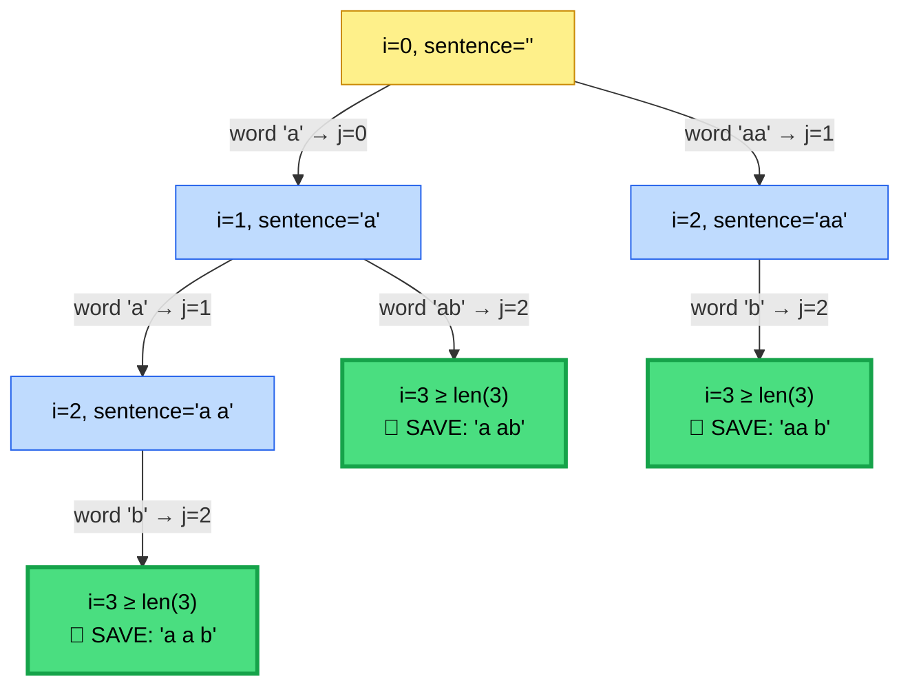
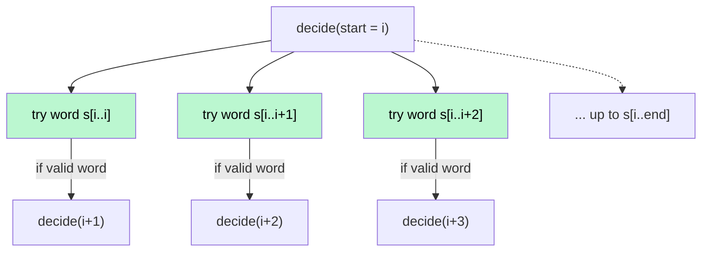

# ✂️ Word Break II — Backtracking Solution

A C++ backtracking solution to the **"Word Break II"** problem — split a string into every possible sentence made of dictionary words, with visual walkthroughs and a full recursion tree.

---

## 📜 Problem in a Nutshell

You're given:
- A string `s`
- A dictionary `wordDict[]`

**Goal:** Return **all possible sentences** where `s` is segmented into a sequence of one or more dictionary words, separated by spaces.

Example:
```
s = "catsanddog"
wordDict = ["cat","cats","and","sand","dog"]

Output:
["cats and dog", "cat sand dog"]
```

Unlike *Word Break I* (which only asks "is it possible?" — a yes/no question), this version needs **every valid segmentation**, so brute-force exploration with backtracking is the natural fit.

---

## 🧠 The Core Idea

```
At every position i in the string, ask:

   "Which prefix, starting at i, is a valid dictionary word —
    and what if I cut here?"
```

For each starting index `i`, we try **every possible end point `j`**, check if `s[i..j]` is a real word, and if so, branch into it. This is a **fan-out tree** (not just binary take/skip) — each node can have as many children as there are valid word-prefixes starting there.

---

## 🔍 Code Walkthrough

### 1️⃣ Setup — Dictionary as a Hash Set

```cpp
unordered_set<string> st;
for(string &word : wordDict) st.insert(word);
```

Converts the word list into a hash set for **O(1) average lookup**, instead of scanning `wordDict` linearly for every substring check.

### 2️⃣ Base Case — Reached the End

```cpp
if(i >= s.length()){
    result.push_back(currSentence);
    return;
}
```

If we've consumed the entire string, `currSentence` represents one complete, valid segmentation — save it.

### 3️⃣ Trying Every Possible Cut

```cpp
for(int j = i; j < s.length(); j++){
    string tempWord = s.substr(i, j - i + 1);
    if(st.count(tempWord)){
        ...
    }
}
```

From index `i`, we stretch the ending index `j` outward one character at a time, testing every prefix `s[i..j]`. Only prefixes that exist in the dictionary trigger a recursive branch.

### 4️⃣ Choose → Explore → Un-choose (the Backtracking Heartbeat)

```cpp
string tempSentence = currSentence;         // 📌 save state
if(!currSentence.empty()) currSentence += " ";
currSentence += tempWord;                    // ✅ choose

backtracking(j + 1, currSentence, s);        // 🔍 explore

currSentence = tempSentence;                  // ↩️ un-choose (restore)
```

This save → mutate → recurse → restore pattern is what lets **one shared string** (`currSentence`) be reused across every branch, instead of allocating a new string per path. It's the classic backtracking "undo" step.

---

## 🌳 Recursion Tree — Worked Example

Let's trace a compact example so the whole tree fits on screen:

```
s        = "aab"
wordDict = ["a", "aa", "ab", "b"]
```

At each index, we check every valid dictionary prefix:



**How `result` fills up (DFS, left-to-right):**

| Step | Path taken | Sentence saved |
|---|---|---|
| 1 | A → B ("a") → E ("ab") | `"a ab"` |
| 2 | A → B ("a") → D ("a") → G ("b") | `"a a b"` |
| 3 | A → C ("aa") → F ("b") | `"aa b"` |

🏆 **Final result:** `["a ab", "a a b", "aa b"]`

Notice how node **B** has *two* children (`"a"` and `"ab"` are both valid words starting at index 1) — this branching factor (not just 2-way take/skip) is what makes Word Break II's tree "bushier" than a typical subset-style backtracking problem.

---

## 🖼️ The "Try Every Cut" Pattern (Generalized)



Each node "fans out" across every substring starting there — this is the same shape used in **Palindrome Partitioning** and other "cut the string every possible way" problems.

---

## ⏱️ Complexity Analysis

| Metric | Value | Why |
|---|---|---|
| **Time** | `O(2ⁿ × n)` worst case | Up to `2ⁿ⁻¹` ways to place cuts in a string of length `n`; each valid path does `O(n)` work to build/copy the sentence |
| **Space** | `O(n)` recursion depth + `O(2ⁿ × n)` to store all results | Output size itself can be exponential (that's inherent to "return all segmentations" problems) |

Since the output can genuinely be exponential (e.g. `s = "aaaaaaaa"` with `wordDict = ["a","aa","aaa",...]`), no algorithm can beat this in the worst case — the real-world speedup opportunity is in **avoiding repeated work on unreachable prefixes**.

---

## 🔧 Possible Optimizations

1. **Prune unreachable branches early** — first run a `Word Break I`–style DP pass to mark which indices can *possibly* reach the end. Skip backtracking into indices that can never complete a valid segmentation.
   ```cpp
   // dp[i] = true if s[i..end] can be fully segmented
   ```
2. **Memoize by index** — cache the list of valid sentences for each suffix `s[i..]`, so overlapping suffixes aren't recomputed (classic **memoized backtracking / DP-with-lists** hybrid).
3. **Limit substring length** — if you know the max word length in `wordDict`, cap how far `j` searches instead of scanning to the end of `s` every time.

---

## ✅ Summary

- Backtracking = **try every valid cut at each position**, recurse into the remainder, then undo before trying the next cut.
- The `tempSentence` save/restore is the backtracking "undo" — it lets a single mutable string double as the path state for every branch.
- The tree isn't binary here — it **fans out** by however many dictionary words start at each index, making this "bushier" than typical take/skip problems.

Happy backtracking! 🚀
