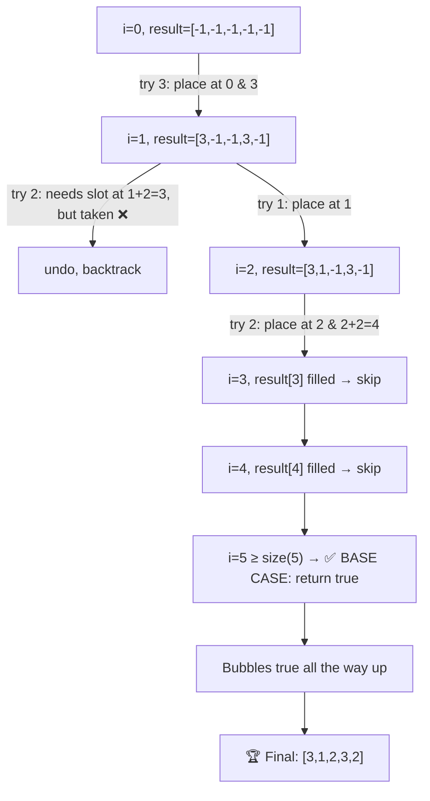

# 🔢 Construct the Lexicographically Largest Valid Sequence

> **LeetCode 1718** — Backtracking with placement constraints in C++

Given an integer `n`, construct a sequence of length `2n - 1` containing each
number from `1` to `n`, where:

- The number `1` appears **exactly once**.
- Every number `x` from `2` to `n` appears **exactly twice**, and the two
  occurrences are **exactly `x` positions apart**.

Among all valid sequences, return the **lexicographically largest** one.

```
Input:  n = 3
Output: [3,1,2,3,2]
```

---

## 📖 Table of Contents

- [Problem Statement](#-problem-statement)
- [Core Idea](#-core-idea)
- [Code Walkthrough](#-code-walkthrough)
- [Recursion Tree (Visual)](#-recursion-tree-visual)
- [Step-by-Step Dry Run (n = 3)](#-step-by-step-dry-run-n--3)
- [Why Try Largest Number First?](#-why-try-largest-number-first)
- [Complexity Analysis](#-complexity-analysis)
- [Edge Cases](#-edge-cases)
- [Full Code](#-full-code)

---

## 📌 Problem Statement

Build `result`, an array of size `2n - 1`, filled with numbers `1..n` such
that:

| Number | Appears | Placement rule |
|---|---|---|
| `1` | once | anywhere |
| `x` (2 ≤ x ≤ n) | twice | at index `i` and index `i + x` |

Return the sequence that is **lexicographically largest** — i.e. the one
that "wins" when compared position-by-position, preferring bigger numbers
as early as possible.

---

## 💡 Core Idea

This is a **fill-the-blanks backtracking** problem:

1. Walk through `result` left to right, index `i = 0, 1, 2, ...`.
2. If `result[i]` is **already filled** (placed earlier as the "second half"
   of some pair), just move to `i + 1`.
3. If it's **empty (`-1`)**, try placing numbers into it — starting from the
   **largest unused number down to `1`** (greedy-largest-first, which is
   what guarantees the *lexicographically largest* result).
4. For a number `num > 1`: it needs **two slots**, `i` and `i + num`. Place
   both, or fail and try a smaller number.
5. For `num == 1`: it only needs **one slot**.
6. If a placement leads to a dead end later, **undo it (backtrack)** and try
   the next smaller number.

```
Place largest number that still fits  →  recurse deeper  →
   if stuck, undo (backtrack)  →  try next smaller number
```

---

## 🔍 Code Walkthrough

```cpp
bool backtracking(int i, int n, vector<int> &result, vector<bool> &used) {

    // ✅ BASE CASE: filled every position successfully
    if (i >= result.size())
        return true;

    // ⏭ Already filled by an earlier pair-placement — skip ahead
    if (result[i] != -1)
        return backtracking(i + 1, n, result, used);

    // 🔁 Try numbers from LARGEST to smallest (greedy for lexicographic max)
    for (int num = n; num >= 1; num--) {
        if (used[num]) continue;

        // ---- TRY ----
        used[num] = true;
        result[i] = num;

        // ---- EXPLORE ----
        if (num == 1) {
            // 1 only needs a single slot
            if (backtracking(i + 1, n, result, used))
                return true;
        } else {
            int j = result[i] + i;              // the "twin" position
            if (j < result.size() && result[j] == -1) {
                result[j] = num;                 // place the twin
                if (backtracking(i + 1, n, result, used))
                    return true;
                result[j] = -1;                  // undo twin
            }
        }

        // ---- UNDO ----
        used[num] = false;
        result[i] = -1;
    }
    return false;   // nothing worked at this index → dead end
}
```

| Piece | Role |
|---|---|
| `result[i] != -1` | Skip index already filled as a "twin" slot |
| `for (num = n; num >= 1; num--)` | **Greedy order**: bigger numbers tried first → largest lexicographic result |
| `j = result[i] + i` | The position `num` positions ahead, where its pair must go |
| `used[]` | Tracks which numbers (1..n) have already been placed |
| Undo block | Classic **backtracking**: try → explore → undo if it didn't work out |

---

## 🌳 Recursion Tree (Visual)

Tracing `n = 3` → `result` has size `2*3 - 1 = 5` (indices `0..4`).



Note how **no backtracking undo was ultimately needed** past `num=2` at
`i=1` — greedy-largest-first got it right on the first fully successful
path. That's not always true for bigger `n`; deeper undos can happen.

---

## 🪜 Step-by-Step Dry Run (n = 3)

| Step | i | Try num | Action | `result` | `used` | Outcome |
|---|---|---|---|---|---|---|
| 1 | 0 | 3 | place at `0`, twin at `0+3=3` | `[3,-1,-1,3,-1]` | {3} | continue |
| 2 | 1 | 3 | already used, skip | — | — | — |
| 3 | 1 | 2 | place at `1`, twin needed at `1+2=3` → **occupied**, fail | undo | {3} | try next |
| 4 | 1 | 1 | place at `1` (single slot) | `[3,1,-1,3,-1]` | {3,1} | continue |
| 5 | 2 | 3 | already used, skip | — | — | — |
| 6 | 2 | 2 | place at `2`, twin at `2+2=4` → empty ✅ | `[3,1,2,3,2]` | {3,1,2} | continue |
| 7 | 3 | — | `result[3]=3` already filled → skip to `i=4` | — | — | continue |
| 8 | 4 | — | `result[4]=2` already filled → skip to `i=5` | — | — | continue |
| 9 | 5 | — | `i >= 5` → **base case**, return `true` | — | — | ✅ done |

**Final answer:** `[3, 1, 2, 3, 2]` ✅

---

## 🥇 Why Try Largest Number First?

The loop deliberately goes `for (num = n; num >= 1; num--)` instead of
ascending order. Since we fill the array **left to right**, whichever number
we successfully place at the *earliest empty index* has the biggest impact
on lexicographic order (like the most significant digit in a number).

```
Comparing two valid sequences:
[3, 1, 2, 3, 2]   vs   [2, 3, 2, 1, 3]
   ↑                      ↑
  first index differs — 3 > 2, so the first sequence wins lexicographically
```

By always attempting the **biggest available number first** at each index,
and only backtracking when that choice provably fails, the first complete
solution found by the algorithm is guaranteed to be the lexicographically
largest one — so the moment `backtracking()` returns `true`, we're done.

---

## ⏱ Complexity Analysis

| Aspect | Complexity | Why |
|---|---|---|
| **Time (worst case)** | `O(n!)` -ish, but heavily pruned in practice | At each empty slot we branch over up to `n` unused numbers |
| **Space** | `O(n)` | `result` array (`2n-1`), `used` array (`n+1`), recursion depth up to `2n-1` |
| **Practical performance** | Very fast for typical constraints (`n ≤ 20`) | Greedy-largest-first plus early pruning (`j` bounds / occupancy check) prunes most invalid branches immediately |

---

## 🧠 Edge Cases

- **`n = 1`** → `result` size is `1`; only number `1` exists, placed at
  index `0`. Output: `[1]`.
- **`n = 2`** → Output: `[2,1,2]` (try 2 first: place at `0` and `0+2=2`,
  then `1` fills the middle).
- **No valid twin slot available** → the algorithm correctly backtracks
  (`used[num] = false; result[i] = -1;`) and tries the next smaller number.
- **The problem guarantees a solution always exists** for valid `n`, so the
  top-level call will always find `true` eventually.

---

## 🖥 Full Code

```cpp
class Solution {
public:
    bool backtracking(int i, int n, vector<int> &result, vector<bool> &used) {
        if (i >= result.size()) {
            return true;
        }
        if (result[i] != -1) {
            return backtracking(i + 1, n, result, used);
        }
        for (int num = n; num >= 1; num--) {
            if (used[num])
                continue;

            // try
            used[num] = true;
            result[i] = num;

            // explore
            if (num == 1) {
                if (backtracking(i + 1, n, result, used) == true) {
                    return true;
                }
            } else {
                int j = result[i] + i;

                if (j < result.size() && result[j] == -1) {
                    result[j] = num;
                    if (backtracking(i + 1, n, result, used) == true) {
                        return true;
                    }
                    result[j] = -1;
                }
            }
            // undo

            used[num] = false;
            result[i] = -1;
        }
        return false;
    }

    vector<int> constructDistancedSequence(int n) {
        vector<int> result(2 * n - 1, -1);
        vector<bool> used(n + 1, false);
        backtracking(0, n, result, used);
        return result;
    }
};
```

---

<p align="center">
  ⭐ If this explanation helped, consider starring the repo! ⭐
</p>
