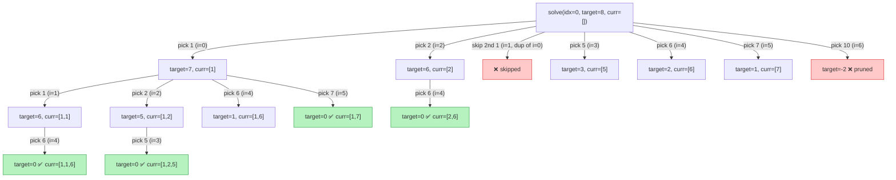

# 🎯 Combination Sum II — Backtracking Explained

> Find all unique combinations in `candidates` that sum up to `target`, where each number may be used **only once**, and the result must not contain duplicate combinations.

[](https://isocpp.org/)
[]()
[]()

---

## 📌 Problem in One Line

Given an array with possible duplicates, pick numbers (each index used **at most once**) that add up exactly to `target` — without repeating the same combination twice.

**Example**

```text
Input:  candidates = [10, 1, 2, 7, 6, 1, 5],  target = 8
Output: [
  [1, 1, 6],
  [1, 2, 5],
  [1, 7],
  [2, 6]
]
```

---

## 🧠 The Core Idea

Two problems need solving at once:

| Problem | Solution |
|---|---|
| Each element can only be used **once** | Recurse with `i + 1`, not `i` |
| No **duplicate combinations** in output | **Sort** first, then skip repeated values *at the same recursion depth* |

The magic line is this one:

```cpp
if (i > index && candidates[i] == candidates[i - 1]) {
    continue;
}
```

This does **not** forbid using duplicate values altogether (`[1, 1, 6]` is valid!). It only forbids picking the *same value twice as a starting point in the same for-loop level*, which is exactly what causes duplicate combinations.

---

## 🖼️ Visualizing the Skip Rule

```text
sorted candidates: [1, 1, 2, 5, 6, 7, 10]
                     ↑  ↑
                index=0 index=1  → SAME VALUE, i > index → skip 2nd "1" as a NEW branch
```

```text
for i = index ... n-1:
    ┌─────────────────────────────────────────────┐
    │  i == index?  → always allowed (first pick)  │
    │  i  > index?  → allowed UNLESS cand[i]==cand[i-1] │
    └─────────────────────────────────────────────┘
```

So within one call to `solve()`, the loop tries each *distinct* value once as the "next number to add" — but a value can still reappear one level **deeper** in the recursion (different `index`), which is how `[1, 1, 6]` still gets built.

---

## 🌳 Recursion Tree

For `candidates = [1, 1, 2, 5, 6, 7, 10]` (sorted), `target = 8`:



🟢 **Green** = `target == 0` → a valid combination is pushed to `result`
🔴 **Red** = pruned branch (either `target < 0`, or a duplicate starting value skipped by the `continue`)

The four green leaves are exactly the four expected outputs: `[1,7]`, `[1,1,6]`, `[1,2,5]`, `[2,6]`.

---

## 📝 Line-by-Line Walkthrough

```cpp
void solve(vector<int>& candidates, int target, vector<int> &curr,
           int index, vector<vector<int>> &result) {

    if (target < 0) return;                 // 🔴 overshoot → dead end, backtrack

    if (target == 0) {                      // 🟢 exact match → save this combination
        return result.push_back(curr);
    }

    for (int i = index; i < candidates.size(); i++) {

        if (i > index && candidates[i] == candidates[i - 1]) {
            continue;                        // ⛔ skip duplicate "starting" value at this level
        }

        curr.push_back(candidates[i]);       // ✅ choose
        solve(candidates, target - candidates[i], curr, i + 1, result); // 🔁 explore
        curr.pop_back();                     // ↩️ un-choose (backtrack)
    }
}
```

| Step | What happens |
|---|---|
| **Sort first** | Groups duplicates together so the skip check (`candidates[i]==candidates[i-1]`) actually works |
| **`target < 0`** | Sum has overshot — prune this path |
| **`target == 0`** | Found a valid combination — record `curr` |
| **`i > index` check** | Prevents re-using the same value as a *sibling* branch → kills duplicate combinations |
| **`i + 1` in recursive call** | Prevents the *same element* (same index) from being reused → each element used once |
| **`push_back` / `pop_back`** | Classic backtracking: try a choice, recurse, then undo it before trying the next |

---

## ⚙️ Complexity

| | Complexity |
|---|---|
| **Time** | `O(2ⁿ)` worst case (subset-sum style search space), pruned heavily by sorting + `target < 0` cuts |
| **Space** | `O(n)` recursion depth + `O(n)` for `curr`, excluding output storage |

---

## ✅ Quick Recap

```text
   sort()  →  groups duplicate values together
      │
      ▼
 for each index, try each *distinct* next value
      │
      ├─ target < 0        → prune 🔴
      ├─ target == 0        → record combo 🟢
      └─ i > index && dup   → skip to avoid duplicate combos ⛔
```

That's the whole trick: **sort + skip-same-level-duplicates + move index forward by 1** = unique combinations, each element used at most once. 🎉
