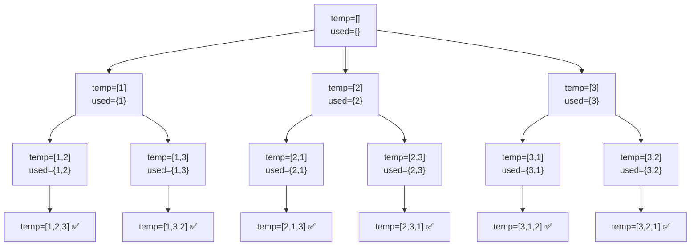

# Permutations (Backtracking) — LeetCode 46

Generate all possible permutations of a distinct integer array `nums`.

## Code

```cpp
class Solution {
public:
    int n;
    unordered_set<int> st;
    vector<vector<int>> result;

    void backtracking(vector<int>& nums, vector<int>& temp) {
        if (temp.size() == n) {
            result.push_back(temp);
            return;
        }

        for (int i = 0; i < n; i++) {
            if (st.find(nums[i]) == st.end()) {
                temp.push_back(nums[i]);
                st.insert(nums[i]);
                backtracking(nums, temp);
                temp.pop_back();
                st.erase(nums[i]);
            }
        }
    }

    vector<vector<int>> permute(vector<int>& nums) {
        n = nums.size();
        vector<int> temp;
        backtracking(nums, temp);
        return result;
    }
};
```

## How it works

1. `temp` holds the permutation currently being built; `st` (a hash set) tracks which numbers are **already used** in `temp`.
2. Unlike the "combinations" pattern, the loop here always starts from index `0` — every position is free to pick **any** unused number, not just numbers after the last one chosen. That's what makes order matter (permutations vs combinations).
3. At each call, we try every index `i` from `0` to `n-1`:
   - **Skip** if `nums[i]` is already in `st` (already used in this branch).
   - **Choose** — push `nums[i]` into `temp`, mark it used in `st`.
   - **Explore** — recurse; the next call again scans all `n` indices, but the used ones get skipped.
   - **Un-choose (backtrack)** — pop `nums[i]` from `temp` and remove it from `st`, freeing it for other branches (e.g. sibling calls, or after we return further up the tree).
4. **Base case:** `temp.size() == n` means we've placed all numbers → save a copy into `result`.

## Recursion tree for `nums = [1, 2, 3]`

Each node shows `temp` at that point. Leaves marked ✅ are full permutations saved into `result`.



**Result:**
```
[1,2,3], [1,3,2], [2,1,3], [2,3,1], [3,1,2], [3,2,1]
```

## Step-by-step trace (partial)

```
backtracking([1,2,3], [])          used={}
├── i=0 → choose 1 → temp=[1]      used={1}
│   └── backtracking(...)
│       ├── i=0 → 1 in used → skip
│       ├── i=1 → choose 2 → temp=[1,2]   used={1,2}
│       │   └── backtracking(...)
│       │       ├── i=2 → choose 3 → temp=[1,2,3]
│       │       │   └── size==n(3) → save [1,2,3]
│       │       └── pop 3, erase 3       used={1,2}
│       │   pop 2, erase 2               used={1}
│       └── i=2 → choose 3 → temp=[1,3]  used={1,3}
│           └── backtracking(...)
│               └── i=1 → choose 2 → temp=[1,3,2]
│                   └── size==n(3) → save [1,3,2]
│   pop 1, erase 1                       used={}
├── i=1 → choose 2 → temp=[2]  ... (same pattern) ...
└── i=2 → choose 3 → temp=[3]  ... (same pattern) ...
```

## Complexity

| | Complexity |
|---|---|
| Time | `O(n · n!)` — n! permutations, each of size n copied into `result` |
| Space | `O(n)` for `temp` + `st`, plus `O(n)` recursion depth (excluding the output) |

## Key pattern: combinations vs. permutations

| | Combinations | Permutations |
|---|---|---|
| Loop starts at | `start` (index *after* last chosen) | `0` (every index, every call) |
| Duplicate use prevented by | never revisiting earlier indices | a `used`/`st` set checked each iteration |
| Order matters? | No — `[1,2] == [2,1]` | Yes — `[1,2] ≠ [2,1]` |

The **choose → explore → un-choose** triangle is the same core template in both:
```
choose   → temp.push_back(x); st.insert(x);
explore  → backtracking(nums, temp);
unchoose → temp.pop_back(); st.erase(x);
```
