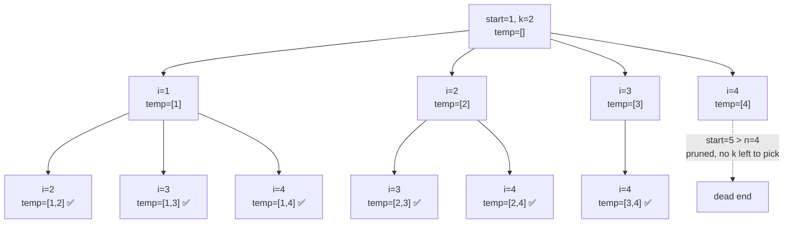

# Combinations (Backtracking) — LeetCode 77

Generate all possible combinations of `k` numbers chosen from the range `[1, n]`.

## Code

```cpp
class Solution {
public:
    vector<vector<int>> result;

    void backtracking(int start, int &n, int k, vector<int> &temp) {
        if (k == 0) {
            result.push_back(temp);
            return;
        }
        if (start > n)
            return;

        for (int i = start; i <= n; i++) {
            temp.push_back(i);
            backtracking(i + 1, n, k - 1, temp);
            temp.pop_back();
        }
    }

    vector<vector<int>> combine(int n, int k) {
        vector<int> temp;
        backtracking(1, n, k, temp);
        return result;
    }
};
```

## How it works

1. `temp` holds the combination currently being built.
2. At each call, we try every number `i` from `start` to `n`:
   - **Choose** — push `i` into `temp`.
   - **Explore** — recurse with `start = i + 1` and `k - 1` (one fewer number needed).
   - **Un-choose (backtrack)** — pop `i` from `temp` so the next candidate can be tried.
3. **Base case:** `k == 0` means `temp` is a full combination of length `k` → save a copy into `result`.
4. **Pruning:** `start > n` stops a branch early once there aren't enough numbers left to reach the range.

## Recursion tree for `n = 4, k = 2`

Each node shows the `temp` array at that point. Leaves marked ✅ are the ones saved into `result` (when `k` hits 0).



**Result:**
```
[1,2], [1,3], [1,4], [2,3], [2,4], [3,4]
```

## Step-by-step trace (partial)

```
backtracking(1, 4, 2, [])
├── i=1 → temp=[1]
│   └── backtracking(2, 4, 1, [1])
│       ├── i=2 → temp=[1,2]
│       │   └── backtracking(3, 4, 0, [1,2]) → k==0 → save [1,2]
│       ├── i=3 → temp=[1,3]
│       │   └── backtracking(4, 4, 0, [1,3]) → k==0 → save [1,3]
│       └── i=4 → temp=[1,4]
│           └── backtracking(5, 4, 0, [1,4]) → k==0 → save [1,4]
├── i=2 → temp=[2]  ... (same pattern) ...
├── i=3 → temp=[3]  ... (same pattern) ...
└── i=4 → temp=[4]
    └── backtracking(5, 4, 1, [4]) → start(5) > n(4) → pruned
```

## Complexity

| | Complexity |
|---|---|
| Time | `O(k · C(n, k))` — one C(n, k) combinations, each of size `k` copied into `result` |
| Space | `O(k)` recursion depth / `temp` size (excluding the output) |

## Key backtracking pattern

```
choose   → temp.push_back(i)
explore  → backtracking(i + 1, n, k - 1, temp)
unchoose → temp.pop_back()
```

This **choose → explore → un-choose** triangle is the core template for almost all backtracking problems (subsets, permutations, combination sum, etc.).
