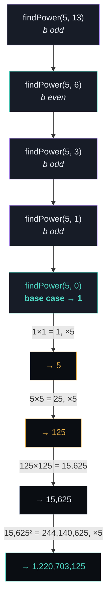

# 🔢 Count Good Numbers

> **LeetCode 1922** · Modular Exponentiation · Recursion

A digit string is **good** if every digit at an **even index** is even, and every digit
at an **odd index** is prime. This repo counts how many good strings of length `n` exist,
modulo `1e9 + 7` — using **exponentiation by squaring** so it works even when `n` is as
large as `10^15`.

---

## 📜 Problem

| Index type | Allowed digits | Choices |
|:----------:|:---------------:|:-------:|
| **Even** (0, 2, 4, …) | `0, 2, 4, 6, 8` | 5 |
| **Odd** (1, 3, 5, …)  | `2, 3, 5, 7`    | 4 |

```
index:   0   1   2   3   4   5
         │   │   │   │   │   │
        even odd even odd even odd
         5   4    5   4    5   4     ← choices at each position
```

Since each position is independent, the total count is just the product of choices:

$$
\text{answer} = 5^{\lceil n/2 \rceil} \times 4^{\lfloor n/2 \rfloor} \pmod{10^9+7}
$$

---

## ⚡ Why not just loop?

`n` can be up to `10^15`. Multiplying `a` by itself `b` times is `O(b)` — far too slow.
**Exponentiation by squaring** computes `a^b mod M` in `O(log b)` steps instead:

| Approach | Steps for `b ≈ 5×10^14` |
|---|---|
| Naïve loop | ~500,000,000,000,000 ❌ |
| Binary exponentiation | ~50 ✅ |

**Idea:** `a^b = (a^(b/2))²`, with one extra factor of `a` tacked on if `b` is odd.

---

## 🌳 Recursion tree — `findPower(5, 13)`



Going **down**, the exponent halves each call.
Going back **up**, each result is squared — and an extra `× a` is folded in wherever
the exponent on the way down was odd.

---

## 🧩 Code

```cpp
class Solution {
public:
    const int M = 1e9 + 7;

    int findPower(long long a, long b) {
        if (b == 0) {
            return 1;                        // base case: a^0 = 1
        }
        long long half = findPower(a, b / 2); // recurse on half the exponent
        long long result = (half * half) % M; // square it → covers even b
        if (b % 2 == 1) {
            result = (result * a) % M;        // odd b needs one extra factor
        }
        return result;
    }

    int countGoodNumbers(long long n) {
        return (long long) findPower(5, (n + 1) / 2)   // even-index positions
                          * findPower(4, n / 2) % M;    // odd-index positions
    }
};
```

| Line | What it does |
|---|---|
| `if (b == 0) return 1;` | Base case — stops the recursion |
| `findPower(a, b/2)` | The key trick: one recursive call at **half** the size |
| `(half * half) % M` | Squaring gives `a^b` directly when `b` is even |
| `if (b % 2 == 1) ...` | Corrects for the remainder of 1 lost when halving an odd `b` |
| `findPower(5, (n+1)/2)` | Counts all even-index digit choices |
| `findPower(4, n/2)` | Counts all odd-index digit choices |

---

## 📊 Complexity

| | Complexity | Why |
|---|---|---|
| **Time** | `O(log n)` | Exponent halves every call |
| **Space** | `O(log n)` | One recursion-stack frame per halving |

---

## ✅ Example

```
n = 1  →  "4"                         → 4 good strings   (only 1 even index)
n = 4  →  "2582"                      → 400 good strings
n = 50 → too large to brute force, but findPower handles it in ~50 steps
```
