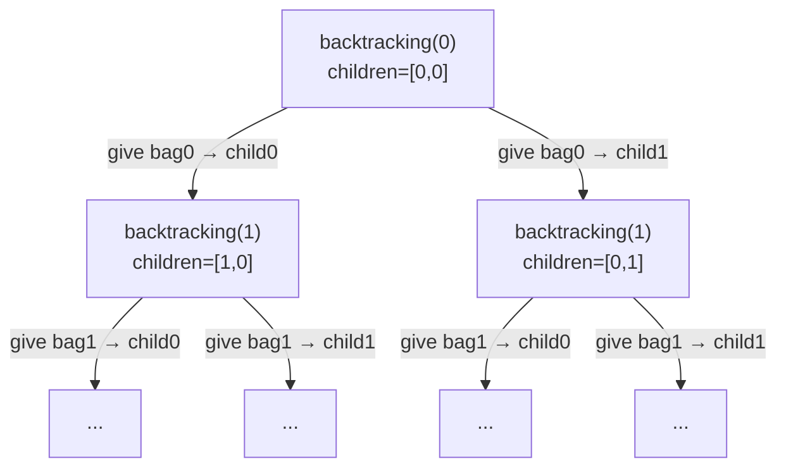

# 🍪 Fair Distribution of Cookies — Backtracking Explained

> **LeetCode 2305** — You have `cookies[i]` cookies in the `i`-th bag and `k` children. Give **every bag entirely** to exactly one child (bags can't be split). The **"unfairness"** of a distribution is the **maximum** total cookies any single child receives. Find the distribution that **minimizes** this unfairness.

---

## 📋 Table of Contents

1. [Problem Intuition](#-problem-intuition)
2. [Core Idea](#-core-idea)
3. [Line-by-Line Code Walkthrough](#-line-by-line-code-walkthrough)
4. [Recursion Flow Diagram](#-recursion-flow-diagram)
5. [Worked Example with Recursion Tree](#-worked-example-with-recursion-tree)
6. [Complexity Analysis](#-complexity-analysis)
7. [Key Takeaways](#-key-takeaways)

---

## 💡 Problem Intuition

Imagine you have several **bags of cookies** and a fixed number of **children**. Each bag must go, whole, to exactly one child. You want to hand out all the bags so that **no child ends up with way more cookies than the others** — formally, minimize the **maximum** amount any one child receives.

Since each bag can go to any of `k` children, and there are `n` bags, there are `k^n` total ways to distribute them. `n` and `k` are small in this problem's constraints, so we can **brute-force every assignment** using backtracking and just track the best (smallest) "worst-case child total" seen.

---

## 🧠 Core Idea

For **each bag/cookie**, we don't have just 2 choices (take/skip) like a subset problem — we have **`k` choices**: *"give this bag to child 0, or child 1, or ... or child k-1."*

```
                 ┌───────────────────┐
                 │  cookies[index]    │
                 └─────────┬──────────┘
        ┌──────────┬───────┴───────┬──────────┐
     give to     give to        give to     give to
     child 0     child 1        child 2  ... child k-1
```

This is a **k-ary tree** (each node has `k` children instead of 2), and we explore it with the same **do → recurse → undo** backtracking pattern.

---

## 🔍 Line-by-Line Code Walkthrough

```cpp
class Solution {
public:
    int n;                  // total number of cookie bags
    int result = INT_MAX;   // best (minimum) "unfairness" found so far
```
- `n` → caches `cookies.size()`.
- `result` → starts at the **largest** possible int, since we're looking for a **minimum** — any real answer will be smaller.

```cpp
    void backtracking(int index, vector<int> &children, vector<int>& cookies, int k) {
```
- `index`    → which cookie bag we're currently deciding on (0 to n-1).
- `children` → array of size `k`; `children[i]` = total cookies child `i` currently holds *along this path*.
- `cookies`  → the input array of bag sizes.
- `k`        → number of children (also the branching factor of our recursion).

```cpp
        if(index >= n) {
```
- **Base case**: every bag (0 to n-1) has been assigned to some child — this distribution is complete.

```cpp
            int Unfair = *max_element(children.begin(), children.end());
```
- `max_element(children.begin(), children.end())` returns an **iterator** pointing to the largest element in `children`.
- The `*` **dereferences** that iterator to get the actual value.
- **In plain words**: *"find the child who ended up with the most cookies — that's the unfairness of this particular distribution."*

```cpp
            result = min(result, Unfair);
            return;
        }
```
- Compare this distribution's unfairness against the best seen so far, and keep the **smaller** one.
- `return` — this recursive branch is done, backtrack up the call stack.

```cpp
        int cookie = cookies[index];
```
- Grab the size of the **current bag** we're about to hand out.

```cpp
        for(int i = 0; i < k; i++) {
```
- **This is the k-ary branching step.** Instead of a binary take/skip, we loop over **all `k` children** and try giving the current bag to each one, one at a time.

```cpp
            children[i] += cookie;
```
- **Give** the current bag to child `i` — add its cookie count to `children[i]`.

```cpp
            backtracking(index + 1, children, cookies, k);
```
- **Recurse** to the next bag (`index + 1`), with this bag now locked in as belonging to child `i`.

```cpp
            children[i] -= cookie;
        }
    }
```
- **Backtrack**: undo the assignment — remove the bag from child `i` again, so `children` is back to its state *before* this loop iteration, ready to try giving the bag to the **next** child `i+1` instead.

```cpp
    int distributeCookies(vector<int>& cookies, int k) {
        n = cookies.size();
        vector<int> children(k, 0);
        backtracking(0, children, cookies, k);
        return result;
    }
};
```
- **Entry point:**
  - Set `n`.
  - Initialize `children` — one slot per child, all starting at `0` cookies.
  - Kick off recursion at bag `index = 0`.
  - Return the best (minimum) `result` found across **all** `k^n` possible distributions.

---

## 🌳 Recursion Flow Diagram

Each level of the tree corresponds to **one bag**, and each node branches into **`k` children** (one per possible recipient):



With `k` children and `n` bags, the tree has **depth `n`** and **`k^n` leaves** total (each leaf = one complete way to distribute all bags).

---

## 🧩 Worked Example with Recursion Tree

Let's trace a **small concrete case**:

```
cookies = [1, 2, 3]     // bag0=1, bag1=2, bag2=3
k = 2                   // 2 children
```

Here `n = 3` bags, `k = 2` children → `2^3 = 8` total distributions.

### Step-by-step trace (all 8 leaves)

| Bag0→ | Bag1→ | Bag2→ | children = [child0, child1] | Unfair = max | result (running min) |
|:---:|:---:|:---:|---|---|---|
| C0 | C0 | C0 | `[1+2+3, 0] = [6, 0]` | 6 | 6 |
| C0 | C0 | C1 | `[1+2, 3] = [3, 3]`   | 3 | **3** |
| C0 | C1 | C0 | `[1+3, 2] = [4, 2]`   | 4 | 3 |
| C0 | C1 | C1 | `[1, 2+3] = [1, 5]`   | 5 | 3 |
| C1 | C0 | C0 | `[2+3, 1] = [5, 1]`   | 5 | 3 |
| C1 | C0 | C1 | `[2, 1+3] = [2, 4]`   | 4 | 3 |
| C1 | C1 | C0 | `[3, 1+2] = [3, 3]`   | 3 | 3 |
| C1 | C1 | C1 | `[0, 1+2+3] = [0, 6]` | 6 | 3 |

**Final answer: `result = 3`** ✅ — e.g. child0 gets bag0+bag1 = `1+2=3`, child1 gets bag2 = `3`. Both children end up with exactly 3 cookies — perfectly fair!

### Recursion tree for this example (k = 2, so it looks binary, but semantically it's "assign to child 0 / child 1")

```
                              backtracking(index=0)
                              children = [0, 0]
                    ┌───────────────────┴───────────────────┐
           bag0 → child0                              bag0 → child1
        children=[1,0]                                children=[0,1]
        ┌───────┴────────┐                          ┌───────┴────────┐
  bag1→child0        bag1→child1                bag1→child0      bag1→child1
  children=[3,0]     children=[1,2]              children=[2,1]   children=[0,3]
   ┌───┴───┐          ┌───┴───┐                   ┌───┴───┐        ┌───┴───┐
 bag2→c0 bag2→c1    bag2→c0 bag2→c1             bag2→c0 bag2→c1  bag2→c0 bag2→c1
 [6,0]   [3,3]       [4,2]   [1,5]               [5,1]   [2,4]    [3,3]   [0,6]
 Unfair=6 Unfair=3   Unfair=4 Unfair=5           Unfair=5 Unfair=4 Unfair=3 Unfair=6
```

`result` walks down to `3` as soon as the **2nd leaf** (`[3,3]`) is visited, and stays `3` forever after since no later leaf produces a smaller `Unfair`. Notice each `children[i] -= cookie` line is what resets the array before the sibling branch is explored — e.g. after fully exploring "bag0→child0", `children` is restored to `[0,0]` before trying "bag0→child1".

---

## ⏱ Complexity Analysis

| Metric | Value | Why |
|---|---|---|
| **Time** | `O(k^n × k)` | Tree has `k^n` leaves (one per full assignment); each leaf does an `O(k)` scan via `max_element` to compute `Unfair` |
| **Space** | `O(n + k)` | Recursion depth = `n` (call stack) + `children` array of size `k` |

Because both `n` and `k` are small in this problem's constraints (`n, k ≤ 8`), `8^8 ≈ 16.7M` worst case is still feasible for brute-force backtracking.

---

## 🎯 Key Takeaways

- ✅ This is a **k-ary backtracking** problem — instead of binary take/skip, every bag has `k` possible recipients, so each recursion level branches `k` ways via the `for(int i = 0; i < k; i++)` loop.
- ✅ **`*max_element(children.begin(), children.end())`** is simply *"who has the most cookies right now?"* — that's the unfairness score for one complete distribution.
- ✅ **Backtracking = do → recurse → undo.** `children[i] += cookie` then `children[i] -= cookie` around the recursive call is what lets the same array be reused for every sibling branch instead of copying it.
- ✅ The recursion tree always has exactly `k^n` leaves — one per possible way to assign all bags to children.
