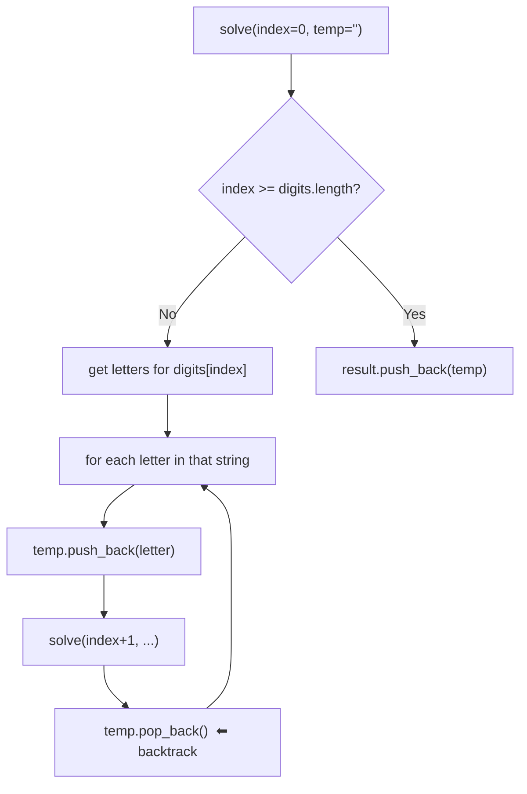

# 📱 Letter Combinations of a Phone Number

A clean **C++ backtracking** solution to the classic *"Letter Combinations of a Phone Number"* problem — given a string of digits (2–9), return every possible letter combination the number could represent, just like old phone keypads (T9 texting).

---

## 🎯 Problem

| Digit | Letters |
|:-----:|:-------:|
| 2 | a b c |
| 3 | d e f |
| 4 | g h i |
| 5 | j k l |
| 6 | m n o |
| 7 | p q r s |
| 8 | t u v |
| 9 | w x y z |

**Input:** `digits = "23"`
**Output:** `["ad","ae","af","bd","be","bf","cd","ce","cf"]`

---

## 🧠 Core Idea — Backtracking

For each digit, we try **every letter** it maps to, one position at a time. After placing a letter we **recurse into the next digit**, and once we've explored that whole branch, we **undo** the choice (`pop_back`) and try the next letter — this "try → recurse → undo" cycle is backtracking.



---

## 🌳 Recursion Tree for `digits = "23"`

Digit `2 → "abc"`, digit `3 → "def"`. The tree below shows every choice explored — this **is** the recursion, visualized:

```mermaid
graph TD
    Root["\"\" (index 0)"]
    Root --> A["a (index 1)"]
    Root --> B["b (index 1)"]
    Root --> C["c (index 1)"]

    A --> AD["ad ✅"]
    A --> AE["ae ✅"]
    A --> AF["af ✅"]

    B --> BD["bd ✅"]
    B --> BE["be ✅"]
    B --> BF["bf ✅"]

    C --> CD["cd ✅"]
    C --> CE["ce ✅"]
    C --> CF["cf ✅"]
```

Each ✅ leaf is reached when `index >= digits.length()` — that's when `temp` is a complete, valid combination and gets pushed into `result`.

---

## 🔍 Code Walkthrough

```cpp
void solve(int index, string &digits, string &temp, unordered_map<char, string> &mp){
    if(index >= digits.length()){      // base case: temp is complete
        result.push_back(temp);
        return;
    }
    char ch = digits[index];           // current digit
    string str = mp[ch];               // its letters, e.g. "abc"

    for(int i = 0; i < str.length(); i++){
        temp.push_back(str[i]);        // 1. CHOOSE a letter
        solve(index + 1, digits, temp, mp); // 2. EXPLORE deeper
        temp.pop_back();               // 3. UN-CHOOSE (backtrack)
    }
}
```

| Step | What happens |
|------|---------------|
| **Choose** | Append a candidate letter to `temp` |
| **Explore** | Recurse to the next digit's index |
| **Un-choose** | Remove the letter so the next candidate can be tried at this position |

`temp` is passed **by reference**, so the same string is mutated and restored across the whole recursion — no extra copies needed at every level.

---

## ⏱️ Complexity

| | Complexity | Why |
|---|---|---|
| **Time** | `O(4^N × N)` | Up to 4 letters per digit (digits 7, 9); N = length of `digits`; each combination costs `O(N)` to build |
| **Space** | `O(N)` (excl. output) | Recursion depth = number of digits |

---

## ▶️ Example Run

```
digits  = "23"
mp['2'] = "abc"
mp['3'] = "def"

solve(0, "", mp)
 ├─ temp="a" → solve(1)
 │   ├─ temp="ad" → solve(2) → base case → save "ad"
 │   ├─ temp="ae" → solve(2) → base case → save "ae"
 │   └─ temp="af" → solve(2) → base case → save "af"
 ├─ temp="b" → solve(1) → ... "bd","be","bf"
 └─ temp="c" → solve(1) → ... "cd","ce","cf"

result = ["ad","ae","af","bd","be","bf","cd","ce","cf"]
```

---

## 🧪 Edge Case

```cpp
if(digits.length() == 0)
    return {};
```
An empty input returns an **empty vector** (not `[""]`) — matches LeetCode's expected behavior.

---

## 🚀 Usage

```cpp
Solution sol;
vector<string> combos = sol.letterCombinations("23");
for (auto &c : combos) cout << c << " ";
// ad ae af bd be bf cd ce cf
```

---

## 📌 Summary

- **Pattern:** Backtracking (choose → explore → un-choose)
- **LeetCode:** #17 – Letter Combinations of a Phone Number
- **Difficulty:** Medium
- **Time:** `O(4^N × N)` · **Space:** `O(N)`
