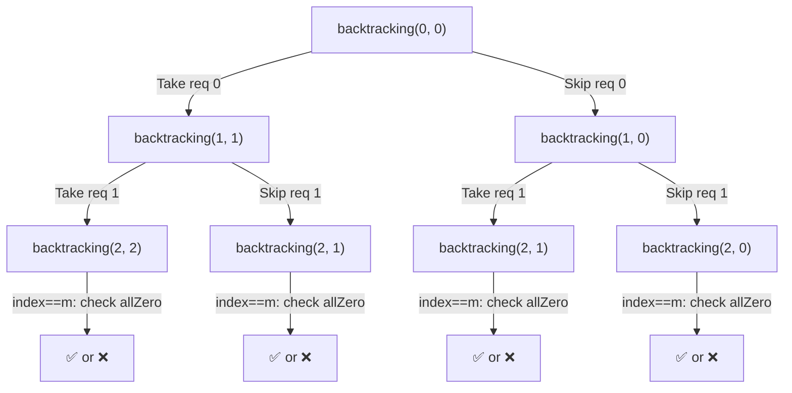

# 🔁 Maximum Number of Achievable Transfer Requests — Backtracking Explained

> **LeetCode 1601** — Given `n` buildings and a list of `requests` (each a `[from, to]` move), find the **maximum number of requests** you can fulfill such that the net number of people entering and leaving every building is **zero** (i.e., the building's population stays balanced).

---

## 📋 Table of Contents

1. [Problem Intuition](#-problem-intuition)
2. [Core Idea](#-core-idea)
3. [Line-by-Line Code Walkthrough](#-line-by-line-code-walkthrough)
4. [Recursion Flow Diagram](#-recursion-flow-diagram)
5. [Worked Example with Recursion Tree](#-worked-example-with-recursion-tree)
6. [Complexity Analysis](#-complexity-analysis)
7. [Key Takeaways](#-key-takeaways)

---

## 💡 Problem Intuition

Think of `n` office buildings. Each `request = [From, To]` means *"one employee wants to move from building `From` to building `To`."*

A request combination is **valid** only if, after applying all chosen requests, **every building has the same number of people leaving as entering** — net change = `0` for all buildings.

We want the **largest possible subset** of requests that satisfies this.

Since `requests.size()` is small (≤ 16 in constraints), we can safely try **every possible subset** using **backtracking** (take it / skip it), and track the best valid count.

---

## 🧠 Core Idea

For every request, we have **2 choices**:

```
            ┌───────────────┐
            │  request[i]   │
            └───────┬───────┘
             ┌───────┴────────┐
        ✅ TAKE it        ❌ SKIP it
      (apply +/- to        (leave counts
       resultant[])          untouched)
```

This is a classic **binary choice / subset-generation recursion** — same pattern as "subsets" or "0/1 knapsack" problems, except our "value" here is *count of requests*, and our "constraint" is *all balances must return to 0*.

---

## 🔍 Line-by-Line Code Walkthrough

```cpp
class Solution {
public:
    int m;                 // total number of requests
    int result = INT_MIN;  // stores the best (max) count of requests satisfied
```
- `m` → caches `requests.size()` so we don't call `.size()` repeatedly.
- `result` → global best answer found so far, starts as smallest possible int so any valid answer beats it.

```cpp
    void backtracking(int index, int count, int n,
                       vector<vector<int>>& requests, vector<int>& resultant) {
```
- `index`   → which request we are currently deciding on.
- `count`   → how many requests we've *taken* so far along this path.
- `n`       → number of buildings (used only for array size reference).
- `requests`→ the full list of `[From, To]` moves.
- `resultant` → **the balance array**. `resultant[i]` = net people entering(+)/leaving(-) building `i`, *for requests taken so far*.

```cpp
    if(index >= m) {
```
- **Base case**: we've made a take/skip decision for *every* request — this recursive path is complete.

```cpp
        bool allZero = true;

        for(int &x : resultant) {
            if(x != 0)
                allZero = false;
        }
```
- **This is the line you asked about!** 🎯
  `for(int &x : resultant)` is a **range-based for loop**:
  - It iterates over **every element** in the `resultant` vector, one at a time.
  - `int &x` means `x` is a **reference** to the actual element (not a copy) — though here we only read it, so a copy (`int x`) would've worked identically; reference just avoids the (tiny) copy cost.
  - **Purpose**: check if *every building's net balance is 0* — meaning the current combination of taken requests is **valid** (movements perfectly cancel out).
  - If **any** building has a non-zero balance, `allZero` becomes `false` and we know this path is invalid.

```cpp
        if(allZero) {
            result = max(result, count);
        }

        return;
    }
```
- If the path is valid (`allZero == true`), we update `result` with the larger of the current best and this path's `count`.
- Either way, we `return` — this recursive branch is finished, backtrack up the call stack.

```cpp
    int From = requests[index][0];
    int To   = requests[index][1];
```
- Extract the source and destination building for the **current** request being decided.

```cpp
    // Take request
    resultant[From]--;
    resultant[To]++;

    backtracking(index + 1, count + 1, n, requests, resultant);
```
- **Choice 1 — TAKE this request:**
  - Someone leaves `From` → `resultant[From]--`
  - Someone enters `To` → `resultant[To]++`
  - Recurse to the *next* request (`index + 1`), incrementing `count` since we used one more request.

```cpp
    // Backtrack
    resultant[From]++;
    resultant[To]--;
```
- **Undo** the change we just made — this is the heart of *backtracking*. We restore `resultant` to how it was **before** we took the request, so the array is clean for the next choice (skip).

```cpp
    // Don't take request
    backtracking(index + 1, count, n, requests, resultant);
}
```
- **Choice 2 — SKIP this request:**
  - `resultant` is untouched (we already restored it above).
  - Recurse to the next request with the **same** `count` (we didn't use this request).

```cpp
    int maximumRequests(int n, vector<vector<int>>& requests) {
        m = requests.size();
        vector<int> resultant(n, 0);
        backtracking(0, 0, n, requests, resultant);
        return result;
    }
};
```
- **Entry point:**
  - Set `m`.
  - Initialize `resultant` — one slot per building, all starting at `0`.
  - Kick off recursion at `index = 0`, `count = 0`.
  - Return the best `result` found across **all** 2^m combinations.

---

## 🌳 Recursion Flow Diagram

At every node, the function branches into exactly two children — **Take** and **Skip** — until `index` reaches `m`:



Each **leaf** represents one complete subset of requests (2 requests here → 2² = 4 leaves). The `for(int &x : resultant)` check runs once per leaf.

---

## 🧩 Worked Example with Recursion Tree

Let's trace through a **tiny concrete example**:

```
n = 2 buildings
requests = [[0,1], [1,0]]     // req0: 0→1,  req1: 1→0
```

### Step-by-step trace

| Step | Path (Take/Skip) | resultant after applying | count | index==m? | allZero? | result |
|------|-------------------|---------------------------|-------|-----------|----------|--------|
| 1 | Take req0, Take req1 | `[-1+0, 1-1] = [0, 0]` | 2 | ✅ | ✅ **YES** | `max(-∞,2)=2` |
| 2 | Take req0, Skip req1 | `[-1, 1]` | 1 | ✅ | ❌ NO | stays `2` |
| 3 | Skip req0, Take req1 | `[1, -1]` | 1 | ✅ | ❌ NO | stays `2` |
| 4 | Skip req0, Skip req1 | `[0, 0]` | 0 | ✅ | ✅ **YES** | `max(2,0)=2` |

**Final answer: `result = 2`** ✅ — both requests can be fulfilled simultaneously (person moves 0→1, another moves 1→0, buildings stay balanced).

### Full recursion tree for this example

```
                         backtracking(index=0, count=0)
                         resultant = [0, 0]
                        /                              \
              TAKE req0(0→1)                    SKIP req0
         resultant=[-1,1], count=1          resultant=[0,0], count=0
             /              \                    /              \
   TAKE req1(1→0)      SKIP req1        TAKE req1(1→0)      SKIP req1
  resultant=[0,0]    resultant=[-1,1]  resultant=[1,-1]    resultant=[0,0]
     count=2            count=1           count=1            count=0
        |                  |                 |                  |
   index==2 ✅        index==2 ✅       index==2 ✅        index==2 ✅
   allZero? YES       allZero? NO       allZero? NO        allZero? YES
   result=max(-∞,2)   (no update)       (no update)        result=max(2,0)
       = 2                                                      = 2
```

Notice how **backtracking** shows up physically in the tree: after exploring the "TAKE req0" subtree completely, the code *undoes* `resultant[From]++; resultant[To]--;` before exploring "SKIP req0" — that's why the SKIP branch starts fresh from `[0,0]` again instead of carrying over `[-1,1]`.

---

## ⏱ Complexity Analysis

| Metric | Value | Why |
|---|---|---|
| **Time** | `O(2^m × n)` | `m` = number of requests → 2 choices each → `2^m` leaves; each leaf does an `O(n)` scan (`for(int &x : resultant)`) |
| **Space** | `O(m + n)` | Recursion depth = `m` (call stack) + `resultant` array of size `n` |

Because `m ≤ 16` in the problem's constraints, `2^16 = 65,536` leaves is small enough to brute-force comfortably.

---

## 🎯 Key Takeaways

- ✅ **Take/Skip backtracking** is the go-to pattern whenever you must try *every subset* of a small list.
- ✅ **`for(int &x : resultant)`** is simply *"check every building's balance — are they all zero?"* — the validity check for one complete subset.
- ✅ **Backtracking = do → recurse → undo.** The `resultant[From]++; resultant[To]--;` lines are what make this "backtracking" rather than plain brute force — they let the *same* array be reused across all branches instead of copying it every call.
- ✅ The recursion tree always has exactly `2^m` leaves — one per possible subset of requests.
