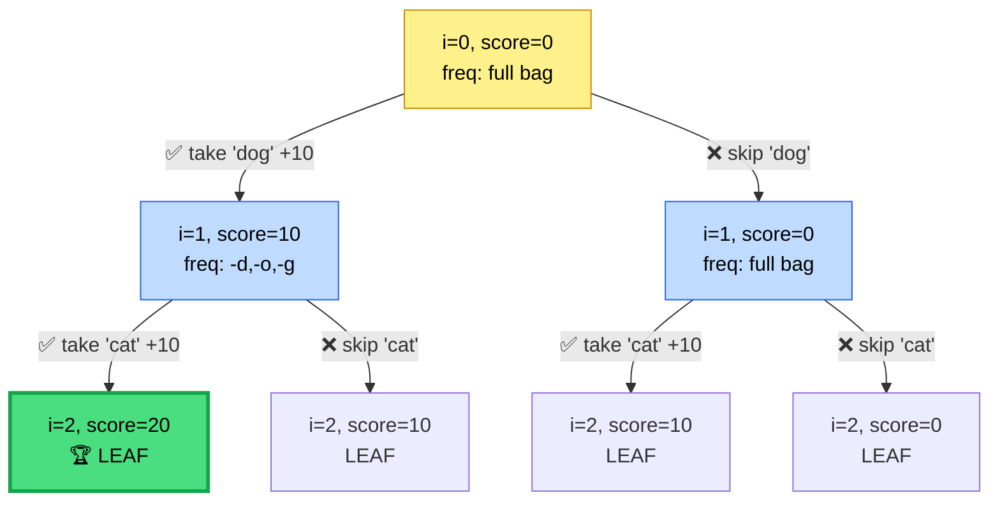
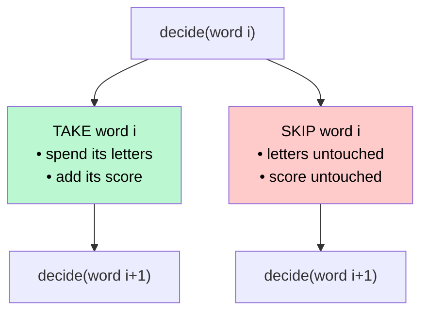

# 🧩 Maximum Score Words Formed by Letters — Backtracking Solution

A clean C++ backtracking solution for the classic **"Maximum Score Words Formed by Letters"** problem, with visual explanations of *why* and *how* it works.

---

## 📜 Problem in a Nutshell

You're given:
- `words[]` — a list of words
- `letters[]` — a bag of letters you own (each usable once)
- `score[]` — points earned for each of the 26 alphabet letters

**Goal:** Pick a subset of words (each word can be formed *only* if you have enough letters left in your bag) that **maximizes total score**.

Each word gives you exactly two choices: ✅ **Take it** or ❌ **Skip it** — the hallmark of a backtracking problem.

---

## 🧠 The Core Idea

```
For every word, at every step, we ask ONE question:

        "Should I include this word or not?"
```

This binary decision at each index, repeated for all words, naturally forms a **binary decision tree** — explore both branches, remember the best result.

---

## 🔍 Code Walkthrough

### 1️⃣ Setup — Building the Letter Bank

```cpp
vector<int> freq(26, 0);
for(char &ch : letters) freq[ch-'a']++;
```

We convert the raw `letters[]` array into a **frequency table** — how many of each letter (`a`–`z`) we own. Much faster than repeatedly scanning `letters[]`.

### 2️⃣ The Recursive Engine

```cpp
void backtracking(int i, vector<int> &score, vector<string> &words,
                   int currScore, vector<int> &freq)
```

| Parameter | Meaning |
|---|---|
| `i` | Index of the word we're currently deciding on |
| `currScore` | Score accumulated so far on this path |
| `freq` | Letters remaining **on this specific path** |

### 3️⃣ Base Case / Score Tracking

```cpp
maxScore = max(maxScore, currScore);
if (i >= n) return;
```

Every node of the recursion tree — not just the leaves — updates `maxScore`. This works because skipping the rest of the words is always a valid (if suboptimal) outcome, so every partial score is a legitimate candidate answer.

### 4️⃣ Trying to Spell the Current Word

```cpp
vector<int> tempFreq = freq;     // copy — don't mutate parent's state!
while (j < words[i].length()) {
    tempFreq[ch-'a']--;
    tempScore += score[ch-'a'];
    if (tempFreq[ch-'a'] < 0) break;   // ran out of that letter
    j++;
}
```

We simulate spelling the word on a **copy** of the frequency table. If we ever go negative on a letter, the word can't be formed — we stop early (a nice built-in pruning step).

### 5️⃣ The Two Branches

```cpp
if (j == words[i].length()) {
    backtracking(i+1, score, words, currScore + tempScore, tempFreq); // TAKE
}
backtracking(i+1, score, words, currScore, freq);                     // SKIP
```

- **Take branch** only fires if the word was fully spellable — pass the *reduced* letter bank forward.
- **Skip branch** always fires — pass the *original* letter bank forward unchanged.

---

## 🌳 Recursion Tree — Worked Example

Let's trace it with a tiny example:

```
words  = ["dog", "cat"]
letters = ['d','o','g','c','a','t']   → every letter available exactly once
score  = a:1  c:9  d:5  g:3  o:2  t:0
```

Since we own every needed letter, **both words are always spellable** whenever we try — so both branches are live at every level:



> `dog` = d(5)+o(2)+g(3) = **10** &nbsp;&nbsp;|&nbsp;&nbsp; `cat` = c(9)+a(1)+t(0) = **10**

**How `maxScore` evolves as the tree is explored (DFS, left-to-right):**

| Step | Node visited | currScore | maxScore so far |
|---|---|---|---|
| 1 | A (i=0) | 0 | 0 |
| 2 | B (i=1, took dog) | 10 | 10 |
| 3 | D (i=2, took dog+cat) | 20 | **20** ✅ |
| 4 | E (i=2, took dog only) | 10 | 20 |
| 5 | C (i=1, skipped dog) | 0 | 20 |
| 6 | F (i=2, took cat only) | 10 | 20 |
| 7 | G (i=2, skipped both) | 0 | 20 |

🏆 **Final answer: 20** (take both words) — found at node **D**.

---

## 🖼️ The "Take vs Skip" Pattern (Generalized)



This is the **same shape** as Subset Sum, 0/1 Knapsack, and Combination Sum — recognizing it instantly speeds up solving similar problems.

---

## ⏱️ Complexity Analysis

| Metric | Value | Why |
|---|---|---|
| **Time** | `O(2ⁿ × L)` | Two choices per word → `2ⁿ` leaves; each path does `O(L)` work to try spelling a word (`L` = avg word length) |
| **Space** | `O(n × 26)` | Recursion depth `n`, and every call copies a 26-length frequency array |

`n ≤ 14` in the original constraints, so `2¹⁴ ≈ 16,384` — comfortably fast. ⚡

---

## 🔧 Possible Optimizations

1. **Avoid copying `freq` on the skip branch** — it's identical to the parent's, so pass by reference instead of relying on the (currently correct) fact that `freq` isn't mutated in place.
2. **Precompute each word's own letter-count map once**, instead of re-scanning `words[i]` on every visit (irrelevant here since each word is visited once per path anyway, but useful if reused).
3. **Prune early**: if `currScore + (sum of all remaining unclaimed max scores) ≤ maxScore`, stop exploring that branch.

---

## ✅ Summary

- Backtracking = **explore every take/skip combination**, undo automatically via fresh copies of state.
- `maxScore` is updated **eagerly at every node**, not just at leaves — so no final aggregation step is needed.
- The `tempFreq` copy is the key trick that keeps sibling branches from corrupting each other's state.

Happy backtracking! 🚀
