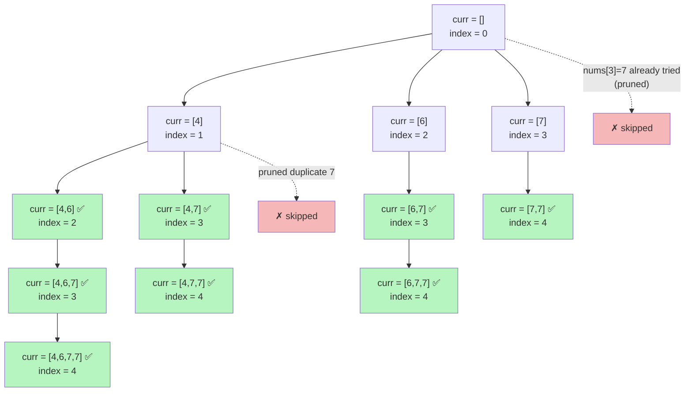

# 🔢 Non-Decreasing Subsequences

> Backtracking solution to **LeetCode 491 — Non-decreasing Subsequences**, implemented in C++.

## 📖 Problem Statement

Given an integer array `nums`, find all the **different possible non-decreasing subsequences** of the given array with **at least two elements**. The array may contain duplicates, but returned subsequences must **not be duplicated**.

**Example**

```
Input:  nums = [4, 6, 7, 7]
Output: [[4,6], [4,6,7], [4,6,7,7], [4,7], [4,7,7], [6,7], [6,7,7], [7,7]]
```

## 🧠 Approach

This solution uses **backtracking (DFS)** to explore every possible subsequence:

1. At each recursive call, if the current subsequence (`curr`) has **2 or more elements**, it's a valid answer — add it to `result`.
2. Loop through the remaining elements starting at `index`.
3. To pick `nums[i]` as the next element, two conditions must hold:
   - **Non-decreasing order:** `curr` is empty, or `nums[i] >= curr.back()`.
   - **No duplicate branch at this level:** `nums[i]` hasn't already been tried at the current recursion depth (tracked with an `unordered_set`).
4. Recurse with `nums[i]` included, then backtrack (pop it) and mark it as "used" for this level so we don't build the same subsequence twice.

The `unordered_set` per recursion level is the key trick — it prevents duplicate subsequences **without sorting** the array (which would destroy the original index order needed for correctness) and without a global `set<vector<int>>` (which would be much slower).

## 💻 Code

```cpp
class Solution {
public:
    int n;

    void backtrack(vector<int>& nums, int index, vector<int>& curr, vector<vector<int>>& result) {
        if (curr.size() >= 2) {
            result.push_back(curr);
        }

        unordered_set<int> st; // tracks values already tried at this recursion level

        for (int i = index; i < n; i++) {
            if ((curr.empty() || nums[i] >= curr.back()) && st.find(nums[i]) == st.end()) {
                curr.push_back(nums[i]);
                backtrack(nums, i + 1, curr, result);
                curr.pop_back();
                st.insert(nums[i]);
            }
        }
    }

    vector<vector<int>> findSubsequences(vector<int>& nums) {
        n = nums.size();
        vector<vector<int>> result;
        vector<int> curr;
        backtrack(nums, 0, curr, result);
        return result;
    }
};
```

## 🌳 Recursion Tree

Here's how the backtracking explores `nums = [4, 6, 7, 7]`. Each node shows `curr`, and green nodes are valid answers (`size >= 2`) pushed to `result`. Duplicate branches (same value re-tried at a level) are pruned by the `unordered_set`.



**Final `result`:** `[4,6] [4,6,7] [4,6,7,7] [4,7] [4,7,7] [6,7] [6,7,7] [7,7]` — matches the expected output above. 🎯

### 🔍 How the `unordered_set` prunes branches

At the root level (`index = 0`), we try `nums[0]=4`, `nums[1]=6`, `nums[2]=7`. When we reach `nums[3]=7`, it's already in the level's `st` set (inserted after the `nums[2]=7` branch finished), so that whole subtree is **skipped** — this is exactly what stops `[7]` from being explored twice.

## ⏱️ Complexity

| Metric | Complexity | Notes |
|--------|-----------|-------|
| Time   | `O(2^n · n)` | Worst case explores every subset; each valid one costs `O(n)` to copy |
| Space  | `O(n)` | Recursion depth + `curr` buffer (excluding output storage) |

## ✅ Why the `unordered_set` Matters

Without it, an array like `[4, 4, 4]` would generate the subsequence `[4, 4]` multiple times via different recursive branches (choosing index 0&1, 0&2, 1&2, etc.). By recording which **values** have already started a branch at the current level, we skip redundant work and duplicate results entirely.

## 🚀 Usage

```cpp
Solution sol;
vector<int> nums = {4, 6, 7, 7};
vector<vector<int>> result = sol.findSubsequences(nums);

for (auto& seq : result) {
    for (int x : seq) cout << x << " ";
    cout << "\n";
}
```

## 📌 Constraints (per LeetCode)

- `1 <= nums.length <= 15`
- `-100 <= nums[i] <= 100`

---
🔗 **LeetCode Link:** [491. Non-decreasing Subsequences](https://leetcode.com/problems/non-decreasing-subsequences/)
