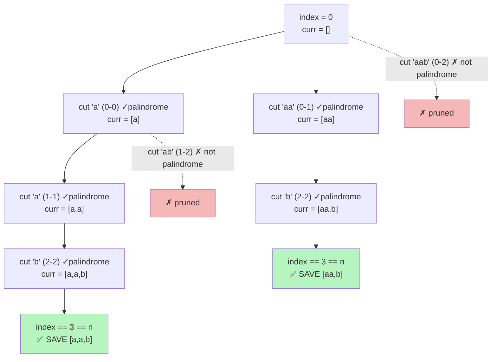

# 🪞 Palindrome Partitioning

> Backtracking solution to **LeetCode 131 — Palindrome Partitioning**, implemented in C++.

## 📖 Problem Statement

Given a string `s`, partition it such that **every substring** of the partition is a **palindrome**. Return **all possible palindrome partitioning** of `s`.

**Example**

```
Input:  s = "aab"
Output: [["a","a","b"], ["aa","b"]]
```

```
Input:  s = "a"
Output: [["a"]]
```

## 🧠 Approach

This is a classic **backtracking (DFS)** problem — at every position, try every possible "cut" and only continue down a branch if the piece cut off is a palindrome.

1. Start at `index = 0`.
2. Try every ending position `i` from `index` to `n-1`.
3. Check if `s[index..i]` is a palindrome using a two-pointer check.
4. If yes → push it into `curr`, recurse from `i+1`, then pop it (backtrack) to try the next cut.
5. When `index == n`, we've partitioned the whole string → save `curr` as one valid answer.

Because we only recurse into palindromic substrings, every leaf of the recursion tree that reaches `index == n` is a **guaranteed valid partition** — no post-filtering needed.

## 💻 Code

```cpp
class Solution {
public:
    int n;

    bool isPalindrome(string &s, int Leftidx, int Rightidx) {
        while (Leftidx < Rightidx) {
            if (s[Leftidx] != s[Rightidx])
                return false;
            Leftidx++;
            Rightidx--;
        }
        return true;
    }

    void backtracking(string &s, int index, vector<string> &curr, vector<vector<string>> &result) {
        if (index == n)
            return result.push_back(curr);

        for (int i = index; i < n; i++) {
            if (isPalindrome(s, index, i)) {
                curr.push_back(s.substr(index, i - index + 1));
                backtracking(s, i + 1, curr, result);
                curr.pop_back();
            }
        }
    }

    vector<vector<string>> partition(string s) {
        n = s.length();
        vector<vector<string>> result;
        vector<string> curr;
        backtracking(s, 0, curr, result);
        return result;
    }
};
```

## 🌳 Recursion Tree

Tracing `s = "aab"` (indices `0='a'`, `1='a'`, `2='b'`). Green leaf nodes are valid partitions saved to `result`; red nodes are cuts that fail the palindrome check and get skipped.



**Final `result`:** `[["a","a","b"], ["aa","b"]]` — matches expected output. 🎯

## 🔎 Palindrome Check Visualized

`isPalindrome` uses the classic **two-pointer** technique — pointers start at both ends and move inward, comparing characters:

```
s = "a b a"
     ↑   ↑
     L   R     s[L] == s[R] → 'a' == 'a' ✓  →  move inward

s = "a b a"
       ↑
      L,R      L >= R → loop ends → true
```

If any pair mismatches (`s[L] != s[R]`), it returns `false` immediately — no need to check further.

## ⏱️ Complexity

| Metric | Complexity | Notes |
|--------|-----------|-------|
| Time   | `O(n · 2^n)` | Worst case (all-unique chars) explores `2^n` partitions, each costs up to `O(n)` to build/copy |
| Palindrome check | `O(n)` per call | Two-pointer scan; called up to `O(n)` times per recursion level |
| Space  | `O(n)` | Recursion depth + `curr` buffer (excluding output storage) |

> 💡 **Optimization tip:** For large inputs, precompute a `dp[i][j]` palindrome table in `O(n²)` first, turning each `isPalindrome` check into `O(1)` — reduces overall time from `O(n · 2^n)` to `O(2^n)` at the cost of `O(n²)` extra space.

## 🚀 Usage

```cpp
Solution sol;
string s = "aab";
vector<vector<string>> result = sol.partition(s);

for (auto& part : result) {
    for (auto& piece : part) cout << piece << " ";
    cout << "\n";
}
```

**Output:**
```
a a b
aa b
```

## 📌 Constraints (per LeetCode)

- `1 <= s.length <= 16`
- `s` contains only lowercase English letters

---
🔗 **LeetCode Link:** [131. Palindrome Partitioning](https://leetcode.com/problems/palindrome-partitioning/)
