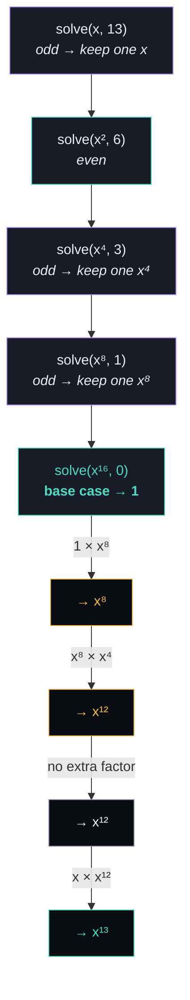

# ✖️ Pow(x, n)

> **LeetCode 50** · Exponentiation by Squaring · Recursion

Implements `myPow(x, n)`, computing `x^n` (`x` is a `double`, `n` is a 32-bit signed
integer that can be **negative**) in `O(log n)` time instead of the obvious `O(n)`
loop of multiplications.

---

## 📜 The three cases

| Case | Rule | Why |
|---|---|---|
| `n == 0` | return `1` | Anything to the power 0 is 1 — base case |
| `n < 0` | `x^n = (1/x)^(-n)` | Flip to the reciprocal and make the exponent positive |
| `n` even | `x^n = (x²)^(n/2)` | Pair up factors two at a time |
| `n` odd | `x^n = x × (x²)^((n-1)/2)` | One factor left over after pairing |

```
x^13 = x × (x²)^6
     = x × ((x²)²)^3
     = x × (x⁴)² × (x⁴)^2 ...   ← exponent keeps halving, base keeps squaring
```

---

## 🧭 Recursion tree — `solve(x, 13)`



Going **down**: the exponent halves, and `x` is **squared** each step (`x → x² → x⁴ → x⁸ → x¹⁶`).
Going back **up**: results multiply together, picking up one extra factor of the
*current level's* base wherever the exponent on the way down was odd.

> Note this is the mirror image of `findPower` from *Count Good Numbers* — there the
> **result** got squared on the way back up; here the **base** gets squared on the way
> down. Both are valid formulations of exponentiation by squaring.

---

## 🧩 Code

```cpp
class Solution {
public:
    double solve(double x, long long n) {

        if (n == 0)
            return 1;                          // base case: x^0 = 1

        if (n < 0) {
            return solve(1 / x, -n);           // negative exponent → reciprocal
        }

        if (n % 2 == 0) {
            return solve(x * x, n / 2);        // even: square x, halve n
        }
        else {
            return x * solve(x * x, (n - 1) / 2); // odd: keep one x, halve the rest
        }
    }

    double myPow(double x, int n) {
        return solve(x, (long long)n);         // widen to long long — see below
    }
};
```

| Line | What it does |
|---|---|
| `if (n == 0) return 1;` | Stops the recursion |
| `if (n < 0) return solve(1/x, -n);` | Converts negative exponents into positive ones on `1/x` |
| `if (n % 2 == 0) return solve(x*x, n/2);` | Even exponent: square the base, halve the exponent |
| `else return x * solve(x*x, (n-1)/2);` | Odd exponent: peel off one `x`, then handle the (now even) remainder |
| `(long long)n` in `myPow` | Prevents overflow — see below |

---

## ⚠️ Why cast to `long long`?

`n` is a 32-bit `int`, and `INT_MIN = -2147483648`. Negating it directly
(`-n`) **overflows** a 32-bit `int`, since `2147483648` doesn't fit in `int`'s positive
range. Widening to `long long` *before* negating avoids undefined behavior:

```cpp
int n = INT_MIN;
// -n            → ❌ overflow (int)
// -(long long)n → ✅ fits comfortably (long long)
```

---

## ✅ Examples

| Input | Output | Path |
|---|---|---|
| `x=2.0, n=10` | `1024.0` | all even splits: `10→5→2→1→0` |
| `x=2.0, n=-2` | `0.25` | negative → `solve(0.5, 2)` |
| `x=2.1, n=3` | `9.261` | odd → keeps one factor at each odd level |
| `x=1.0, n=INT_MIN` | `1.0` | huge negative exponent, but `1^anything = 1` |

---

## 📊 Complexity

| | Complexity | Why |
|---|---|---|
| **Time** | `O(log n)` | The exponent halves on every recursive call |
| **Space** | `O(log n)` | Recursion stack depth matches the number of halvings |
