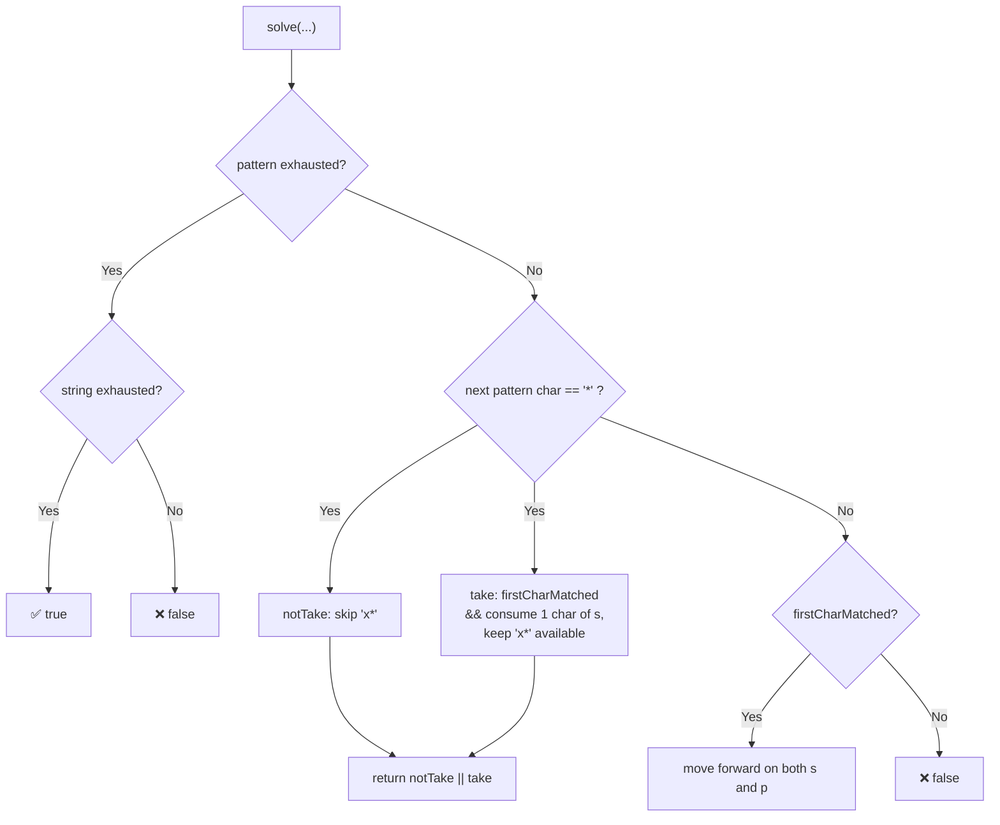
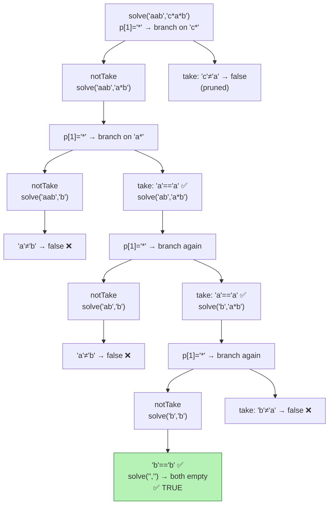
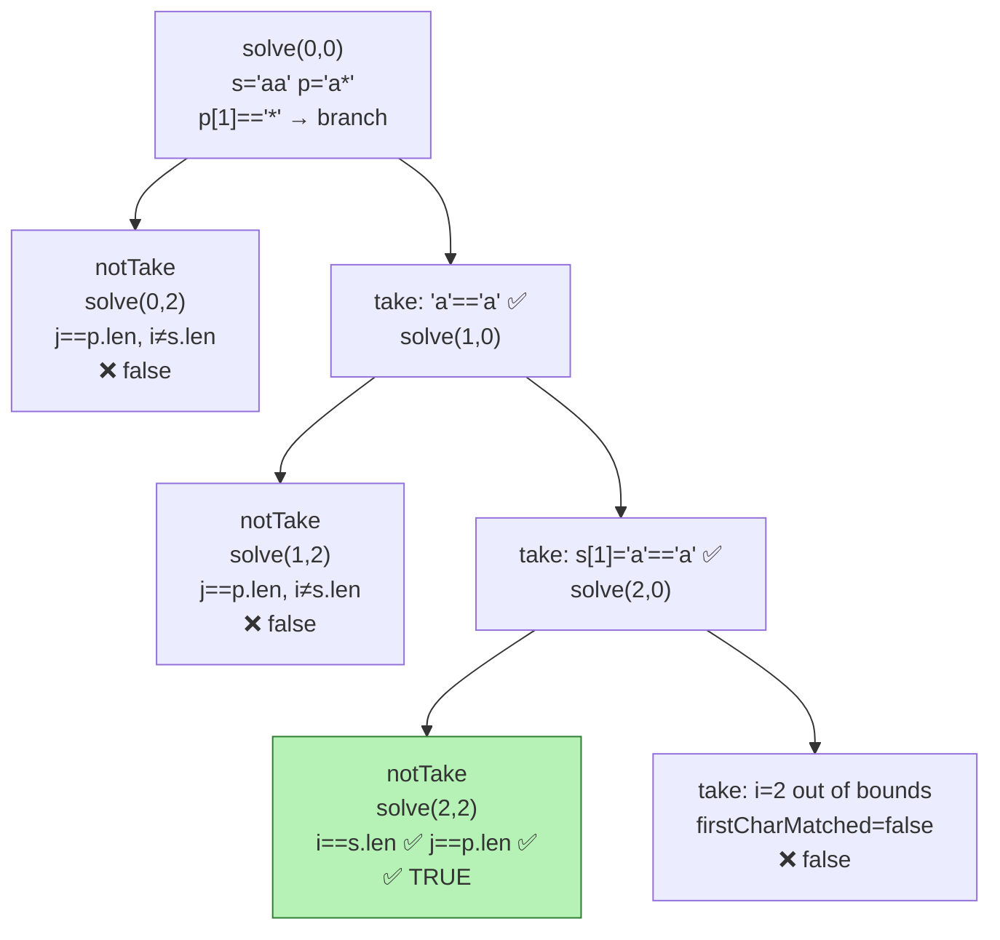

# 🔍 Regular Expression Matching (`.` and `*`) — Master Guide

A complete walkthrough of **LeetCode 10 — Regular Expression Matching**, covering two C++ implementations:

1. 🔁 **Brute Force Recursion** — simplest to understand, exponential time
2. 🧠 **Memoized Top-Down DP** — same logic, cached, polynomial time

> Implement regular expression matching with support for `'.'` and `'*'` where:
> - `'.'` matches any single character
> - `'*'` matches zero or more of the preceding element
> - The match must cover the **entire** input string (not partial)

---

## 📌 Problem Statement

| Input `s` | Input `p` | Output | Why |
|-----------|-----------|--------|-----|
| `"aa"`    | `"a"`     | ❌ false | `"a"` doesn't cover the whole `"aa"` |
| `"aa"`    | `"a*"`    | ✅ true  | `'*'` makes `'a'` repeat, matching `"aa"` |
| `"ab"`    | `".*"`    | ✅ true  | `".*"` means "zero or more of any char" |

---

## 🧠 The Shared Core Idea

Both versions below use **exactly the same decision logic** — only *how state is represented* (strings vs. indices) and *whether results are cached* differ.

At every step, ask: **"Does the character at the front of `p` match the character at the front of `s`?"**

The tricky part is `'*'` — it modifies the **previous** pattern character, meaning "repeat it 0 or more times." Whenever the *next* pattern character is `'*'`, there are two choices:

1. **Don't use it (`notTake`):** skip `"x*"` entirely — 0 repetitions.
2. **Use it (`take`):** if the current characters match, consume one character of `s` and stay on the same pattern position (since `*` can repeat further).

If **either** choice leads to a full match, the answer is `true`.



---

## 🔁 Version 1: Brute Force Recursion

Uses `substr()` to literally shrink `s` and `p` on every call. No caching — clean to read, but recomputes overlapping work.

```cpp
class Solution {
public:
    bool solve(string s, string p) {
        // 🔹 Base case: pattern exhausted
        if (p.length() == 0) {
            return s.length() == 0;   // string must also be exhausted
        }

        // 🔹 Does the current character match?
        bool firstCharMatched = false;
        if (s.length() > 0 &&
            (p[0] == s[0] || p[0] == '.')) {
            firstCharMatched = true;
        }

        // 🔹 Handle '*' lookahead
        if (p.length() >= 2 && p[1] == '*') {
            bool notTake = solve(s, p.substr(2));               // skip "x*"
            bool take = firstCharMatched && solve(s.substr(1), p); // reuse "x*"
            return notTake || take;
        }

        // 🔹 Normal character or '.'
        return firstCharMatched &&
               solve(s.substr(1), p.substr(1));
    }

    bool isMatch(string s, string p) {
        return solve(s, p);
    }
};
```

### Recursion Tree: `s = "aab"`, `p = "c*a*b"`



Many branches dead-end (`❌`) before reaching `true`. Worse — calls like `solve('ab','a*b')` could be reached again from different paths and would be **recomputed from scratch every time**, since nothing is cached.

**Complexity:** `O(2^(m+n))` time worst case, plus extra overhead since every `substr()` call allocates a new string.

---

## 🧠 Version 2: Memoized Top-Down DP

Same exact logic — but state is represented with **indices** `(i, j)` instead of new strings, and results are **cached** in a table `t[i][j]` so no subproblem is solved twice.

```cpp
class Solution {
public:
    int t[21][21];   // memo table: t[i][j] = result of solve(i, j)

    bool solve(int i, int j, string s, string p) {
        // 🔹 Base case: pattern exhausted
        if (j == p.length()) {
            return i == s.length();   // string must also be exhausted
        }

        // 🔹 Return cached result if available
        if (t[i][j] != -1) {
            return t[i][j];
        }

        // 🔹 Does the current character match?
        bool firstCharMatched =
            (i < s.length()) && (p[j] == s[i] || p[j] == '.');

        // 🔹 Handle '*' lookahead
        if (j + 1 < p.length() && p[j + 1] == '*') {
            bool notTake = solve(i, j + 2, s, p);            // skip "x*"
            bool take = firstCharMatched && solve(i + 1, j, s, p); // reuse "x*"
            return t[i][j] = notTake || take;
        }

        // 🔹 Normal character or '.'
        return t[i][j] = firstCharMatched && solve(i + 1, j + 1, s, p);
    }

    bool isMatch(string s, string p) {
        memset(t, -1, sizeof(t));   // -1 = "not computed yet"
        return solve(0, 0, s, p);
    }
};
```

### Recursion Tree: `s = "aa"`, `p = "a*"`



### The Memo Table

```
        j=0   j=1   j=2   (p = "a*")
i=0 →  [ ? ]  [ ]   [ ]
i=1 →  [ ? ]  [ ]   [ ]
i=2 →  [ T ]  [ ]   [ ]
```

- Rows → position in `s`, columns → position in `p`
- `-1` → not computed yet, `0/1` → cached `false`/`true`
- If `solve(i, j)` is ever requested again, it's returned instantly from the table.

**Complexity:** `O(m × n)` time (each state computed once) and `O(m × n)` space for the table.

> ⚠️ Note: `t[21][21]` assumes `s.length() <= 20` and `p.length() <= 20`. For larger inputs, use `vector<vector<int>>` sized to `(s.length()+1) x (p.length()+1)`.

---

## ⚖️ Side-by-Side Comparison

| | 🔁 Brute Force | 🧠 Memoized Top-Down |
|---|---|---|
| **State representation** | New `string` via `substr()` | Integer indices `i, j` |
| **Repeated subproblems** | Recomputed every time | Cached in `t[i][j]` |
| **Time complexity** | `O(2^(m+n))` worst case | `O(m × n)` |
| **Space complexity** | `O(m+n)` stack + string copies per call | `O(m × n)` table + `O(m+n)` stack |
| **Code style** | Simplest to read, no indices | Slightly more bookkeeping, indices instead of substrings |
| **Practical use** | Fine for tiny inputs / learning | Required for LeetCode-scale inputs |

**The upgrade in one sentence:** replace `s.substr(1)` / `p.substr(2)` with index increments (`i+1` / `j+2`), and add a `t[i][j]` cache checked at the top of the function — that's the entire transformation.

---

## ✅ Example Runs (both versions agree)

```text
isMatch("aa",   "a")     → false
isMatch("aa",   "a*")    → true
isMatch("ab",   ".*")    → true
isMatch("aab",  "c*a*b") → true
isMatch("mississippi", "mis*is*p*.") → false
```

---

## 🚀 Key Takeaways

- Both versions implement **identical branching logic** — `take` vs. `notTake` whenever a `'*'` follows.
- The brute force version is best for **understanding the recursion**; the memoized version is best for **actually passing on LeetCode**.
- This same pattern (index-based state + memo table) generalizes to a huge class of string/DP problems: Wildcard Matching, Edit Distance, Interleaving String, and more.
- A natural next step beyond memoization is converting to a **bottom-up (tabulation) DP**, iterating `i` and `j` from the end of the strings backward, filling the same `t[i][j]` table without recursion.
