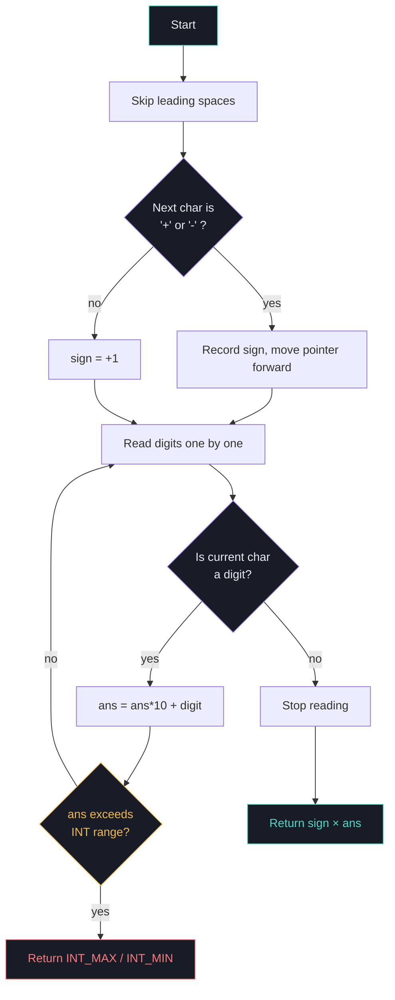

# 🔤 String to Integer (atoi)

> **LeetCode 8** · String Parsing · Simulation

Implements the `myAtoi(string s)` function, which converts a string to a 32-bit signed
integer — the same way the C `atoi` function does, following a strict set of rules for
whitespace, sign, digits, and overflow.

---

## 📜 Rules

1. **Skip** leading whitespace.
2. Read an **optional** `+` or `-` sign (at most one).
3. Read digits until a non-digit character or the end of the string.
4. **Ignore** anything after the digits (no error, just stop).
5. If no digits were read at all, the result is `0`.
6. **Clamp** the result to the 32-bit signed integer range:
   `[-2147483648, 2147483647]`.

```
"   -42abc"
    │└┬┘└┬┘
    │ │  └─ stop parsing here (not a digit)
    │ └──── digits parsed: 4, 2
    └────── sign: '-'
  whitespace skipped
        → result: -42
```

---

## 🧭 Flow



---

## 🧩 Code

```cpp
class Solution {
public:
    int myAtoi(string s) {
        if (s.length() == 0) return 0;

        int i = 0;
        while (i < s.size() && s[i] == ' ') {   // 1. skip leading spaces
            i++;
        }
        s = s.substr(i);

        int sign = +1;
        long ans = 0;

        if (s[0] == '-')                        // 2. optional sign
            sign = -1;

        int MAX = INT_MAX;
        int MIN = INT_MIN;

        i = (s[0] == '+' || s[0] == '-') ? 1 : 0;

        while (i < s.length()) {
            if (s[0] == ' ' || !isdigit(s[i]))   // 3. stop at first non-digit
                break;

            ans = ans * 10 + s[i] - '0';         // 4. accumulate digits

            if (sign == -1 && -1 * ans < MIN)    // 5. clamp on overflow
                return MIN;
            if (sign == 1 && ans > MAX)
                return MAX;

            i++;
        }
        return (int)(sign * ans);
    }
};
```

| Step | What it does |
|---|---|
| `while (s[i] == ' ') i++;` | Skips leading whitespace |
| `s = s.substr(i);` | Drops the whitespace, re-bases the string at index 0 |
| `if (s[0] == '-') sign = -1;` | Detects a leading `-` (default sign is `+1`) |
| `i = (s[0]=='+'\|\|s[0]=='-') ? 1 : 0;` | Skips past the sign character before reading digits |
| `if (!isdigit(s[i])) break;` | Stops parsing at the first non-digit |
| `ans = ans*10 + s[i]-'0';` | Builds the number digit by digit |
| overflow checks | Clamps early to `INT_MIN` / `INT_MAX` instead of letting `ans` overflow |

> ⚠️ **Why `long ans`?** Checking for overflow *after* it already happened in a 32-bit
> `int` is undefined behavior. Accumulating in a `long` and checking the bound on every
> step keeps the comparison safe.

---

## ✅ Examples

| Input | Output | Why |
|---|---|---|
| `"42"` | `42` | Plain digits |
| `"   -42"` | `-42` | Leading spaces skipped, sign applied |
| `"4193 with words"` | `4193` | Stops at first non-digit |
| `"words and 987"` | `0` | No digits at the very start |
| `"-91283472332"` | `-2147483648` | Overflow → clamped to `INT_MIN` |
| `"+-12"` | `0` | Second sign char isn't a digit → nothing parsed |

---

## 📊 Complexity

| | Complexity | Why |
|---|---|---|
| **Time** | `O(n)` | Each character is visited at most once |
| **Space** | `O(n)` | `substr` creates a copy of the trimmed string |

> 💡 The `substr` call can be avoided (and space reduced to `O(1)`) by tracking the
> starting index instead of slicing the string — a good follow-up optimization.
