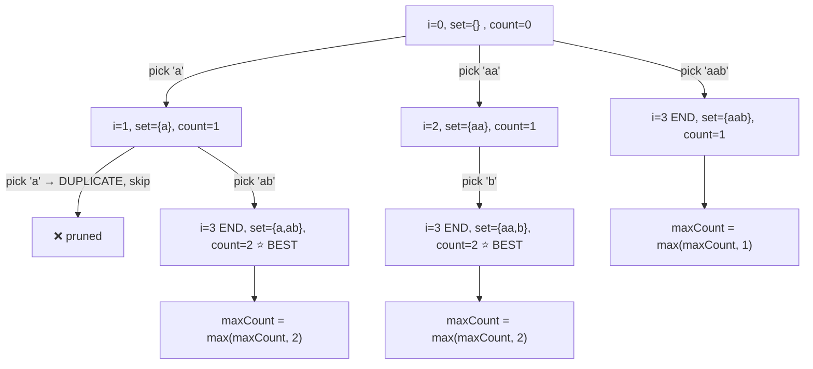

# 🧩 Split a String Into the Max Number of Unique Substrings

> **LeetCode 1593** — Backtracking + Pruning approach in C++

Given a string `s`, split it into a **maximum number of unique substrings**.
Return the number of substrings in the optimal split.

```
Input:  s = "ababccc"
Output: 5
Explanation: One way: "a","b","ab","c","cc" → but must be unique...
Valid answer: "a","b","c","cc" is not max. Best split → 5 unique pieces.
```

---

## 📖 Table of Contents

- [Problem Statement](#-problem-statement)
- [Core Idea](#-core-idea)
- [Code Walkthrough](#-code-walkthrough)
- [Recursion Tree (Visual)](#-recursion-tree-visual)
- [Step-by-Step Dry Run](#-step-by-step-dry-run)
- [Pruning — Why It's Fast](#-pruning--why-its-fast)
- [Complexity Analysis](#-complexity-analysis)
- [Edge Cases](#-edge-cases)
- [Full Code](#-full-code)

---

## 📌 Problem Statement

Split string `s` into **one or more non-empty substrings** such that:

1. Concatenating them in order reproduces `s`.
2. **No two substrings are equal** (all pieces must be unique).
3. **Maximize** the total number of pieces.

---

## 💡 Core Idea

At every index `i` in the string, we try **every possible substring** starting
at `i` — `s[i..i]`, `s[i..i+1]`, `s[i..i+2]`, … up to the end of the string.

For each candidate substring:

- If it's **not already used**, we "pick" it, recurse on the remainder, then
  **undo** the pick (classic *backtracking*: choose → explore → un-choose).
- If it **is already used**, we skip it (that split is invalid).

This explores **every possible way** to cut the string into unique pieces,
and tracks the split that produces the most pieces.

```
s = "abc"

Try "a"  → recurse on "bc"
Try "ab" → recurse on "c"
Try "abc"→ recurse on ""
```

---

## 🔍 Code Walkthrough

```cpp
void backtracking(string &s, int i, unordered_set<string> &st,
                   int &maxCount, int currCount) {

    // 🔪 PRUNING: even if every remaining character became
    // its own unique piece, could we still beat maxCount?
    if (currCount + (s.length() - i) <= maxCount)
        return;

    // ✅ BASE CASE: consumed the whole string
    if (i >= s.length()) {
        maxCount = max(maxCount, currCount);
        return;
    }

    // 🔁 TRY every substring starting at i
    for (int j = i; j < s.length(); j++) {
        string sub = s.substr(i, j - i + 1);   // s[i..j]

        if (st.find(sub) == st.end()) {        // not used yet
            st.insert(sub);                              // CHOOSE
            backtracking(s, j + 1, st, maxCount, currCount + 1); // EXPLORE
            st.erase(sub);                               // UN-CHOOSE
        }
    }
}
```

| Line | Role |
|---|---|
| `currCount + (s.length()-i) <= maxCount` | **Upper-bound pruning**: best case from here is 1 unique char per remaining letter |
| `i >= s.length()` | Base case — reached the end, record the answer |
| `for (j = i; ...)` | Generates every possible next piece: `s[i..i]`, `s[i..i+1]`, … |
| `st.insert / st.erase` | The **backtracking choose/un-choose** pattern |

---

## 🌳 Recursion Tree (Visual)

Let's trace `s = "aab"` (small string so the tree stays readable).

Each node shows `(i, chosen piece, set contents)`. Branches are the possible
substrings starting at index `i`.

```
                                   backtrack(i=0, {})
                              ┌───────────┬────────────┐
                        pick "a"      pick "aa"     pick "aab"
                        {a}            {aa}          {aab}
                       i=1              i=2            i=3
                         │                │              │
              ┌──────────┼─────────┐      │         (i==len → BASE)
          pick "a"❌  pick "ab"  pick "ab"?          currCount=1
          (dup, skip) {a,ab}     -- wait --
                        i=3         (only one option shown)
                         │
                   (i==len → BASE)
                   currCount=2 = MAX ✅
```

A cleaner **Mermaid** version of the same idea (unique-piece choices only):



**Result:** `maxUniqueSplit("aab") = 2` → e.g. `["a", "ab"]` or `["aa", "b"]`.

Every **root-to-leaf path** in this tree is one *complete way* to split the
string. `maxCount` is updated with `currCount` at every leaf, and the biggest
value wins.

---

## 🪜 Step-by-Step Dry Run

For `s = "aab"`:

| Step | i | Action | Set (`st`) | currCount | maxCount |
|---|---|---|---|---|---|
| 1 | 0 | try "a" → insert | {a} | 0→1 | 0 |
| 2 | 1 | try "a" → **already in set, skip** | {a} | 1 | 0 |
| 3 | 1 | try "ab" → insert | {a, ab} | 1→2 | 0 |
| 4 | 3 | i == len(s) → base case | {a, ab} | 2 | **2** |
| 5 | — | backtrack: erase "ab" | {a} | 1 | 2 |
| 6 | — | backtrack: erase "a" | {} | 0 | 2 |
| 7 | 0 | try "aa" → insert | {aa} | 0→1 | 2 |
| 8 | 2 | try "b" → insert | {aa, b} | 1→2 | 2 |
| 9 | 3 | i == len(s) → base case | {aa, b} | 2 | 2 |
| 10 | — | backtrack all the way | {} | 0 | 2 |
| 11 | 0 | try "aab" → insert | {aab} | 0→1 | 2 |
| 12 | 3 | i == len(s) → base case | {aab} | 1 | 2 |

**Final answer: `2`** ✅

---

## ✂️ Pruning — Why It's Fast

Without pruning, this backtracking explores an **exponential** number of
splits (every possible way to cut the string). The single line below saves
massive amounts of wasted work:

```cpp
if (currCount + (s.length() - i) <= maxCount)
    return;
```

**Intuition:** From index `i`, the *absolute best* you could still do is treat
**every remaining character as its own unique piece** — that's
`s.length() - i` more pieces. If even that optimistic best can't beat the
current record (`maxCount`), there's no point continuing down this branch.

```
s.length() = 10, i = 7, currCount = 2, maxCount = 6

Remaining chars = 10 - 7 = 3
Best possible total = 2 + 3 = 5
5 <= 6  → PRUNE! This branch can never win. 🚫
```

This turns a hopeless brute-force search into something that runs comfortably
within LeetCode's limits for strings up to length ~16.

---

## ⏱ Complexity Analysis

| Aspect | Complexity | Why |
|---|---|---|
| **Time (worst case)** | `O(2^n · n)` | At each index we branch into taking 1, 2, 3... chars; roughly `2^n` splits total, each substring op costs `O(n)` |
| **Space** | `O(n)` | Recursion depth + `unordered_set` holding at most `n` substrings, each up to `O(n)` chars |
| **Pruning effect** | Cuts a large fraction of branches in practice | Eliminates paths that mathematically cannot beat the current best |

> ⚠️ Note: `s.length()` is recomputed on every loop iteration/condition —
> for very long strings, caching it (`int n = s.length();`) is a micro-optimization.

---

## 🧠 Edge Cases

- **Single character:** `"a"` → answer is `1`.
- **All same characters:** `"aaaa"` → best split still gives unique pieces
  like `"a", "aa", "aaa"`... actually must fit exactly; answer ends up small
  since repeats can't be reused.
- **All unique characters already:** `"abcdef"` → every single character is
  already unique, so the max split is simply `s.length()`.
- **Empty string:** Not a valid LeetCode input (constraints guarantee
  `1 <= s.length()`), but the code would return `0` safely via the base case.

---

## 🖥 Full Code

```cpp
class Solution {
public:
    void backtracking(string &s, int i, unordered_set<string> &st,
                       int &maxCount, int currCount) {
        if (currCount + (s.length() - i) <= maxCount)
            return;

        if (i >= s.length()) {
            maxCount = max(maxCount, currCount);
            return;
        }

        for (int j = i; j < s.length(); j++) {
            string sub = s.substr(i, j - i + 1);
            if (st.find(sub) == st.end()) {
                st.insert(sub);
                backtracking(s, j + 1, st, maxCount, currCount + 1);
                st.erase(sub);
            }
        }
    }

    int maxUniqueSplit(string s) {
        unordered_set<string> st;
        int maxCount = 0;
        int currCount = 0;
        int i = 0;
        backtracking(s, i, st, maxCount, currCount);
        return maxCount;
    }
};
```

---

<p align="center">
  ⭐ If this explanation helped, consider starring the repo! ⭐
</p>
